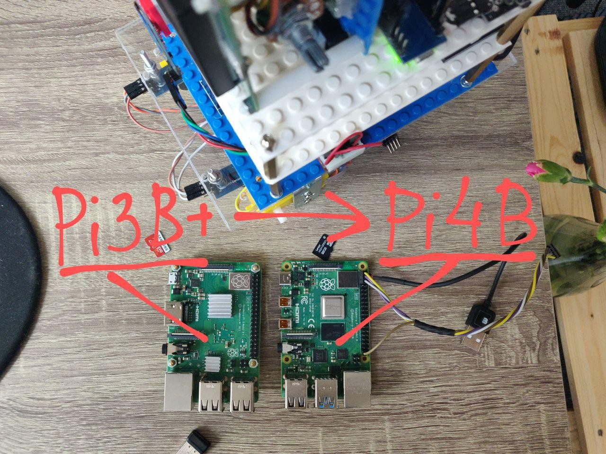

Ok, [ROS](https://www.ros.org/) needs RAM.

Just received Raspberry Pi 4 B with 4 GB of RAM and finally I can continue implementation of [this structure](https://hackaday.io/project/171888-zakhar-the-robot/log/179474-improved-ros-based-architecture-for-the-program-core). Stay tuned!

