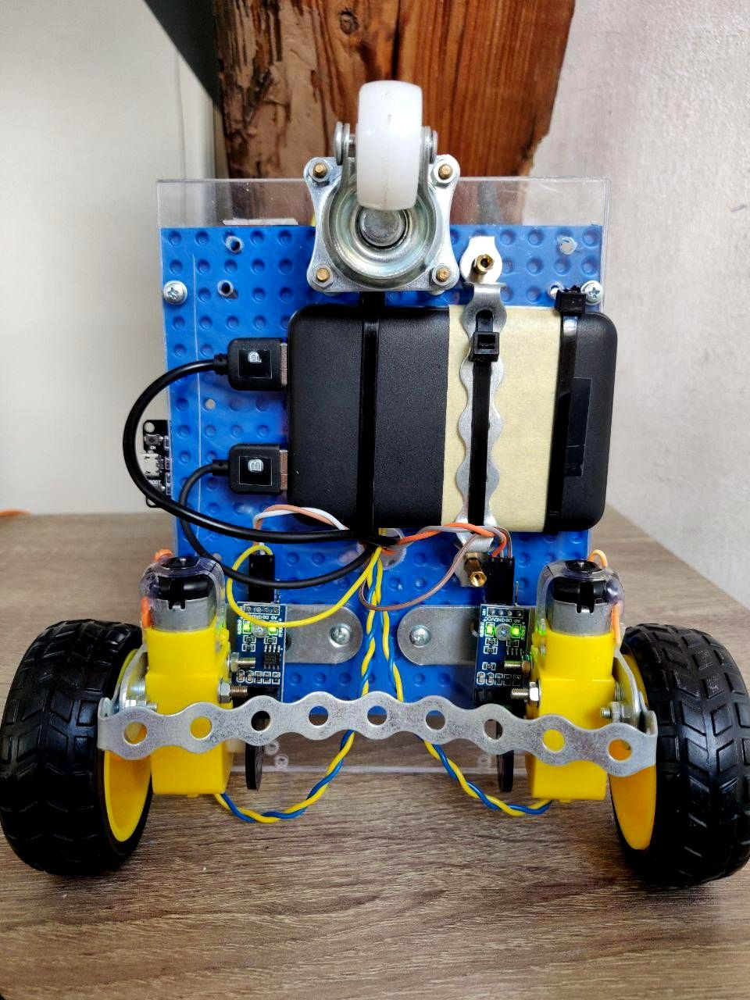
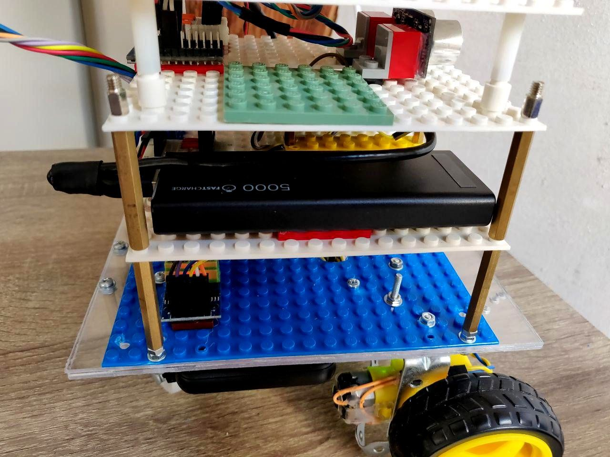
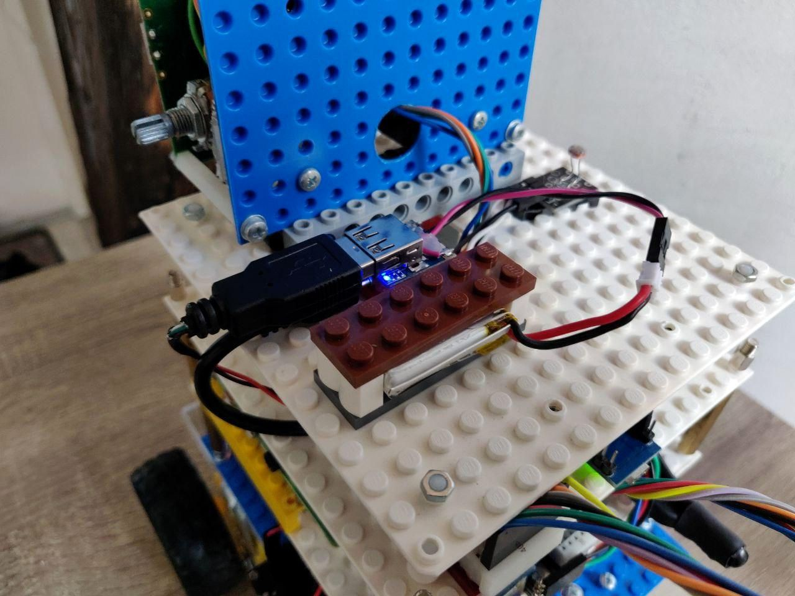
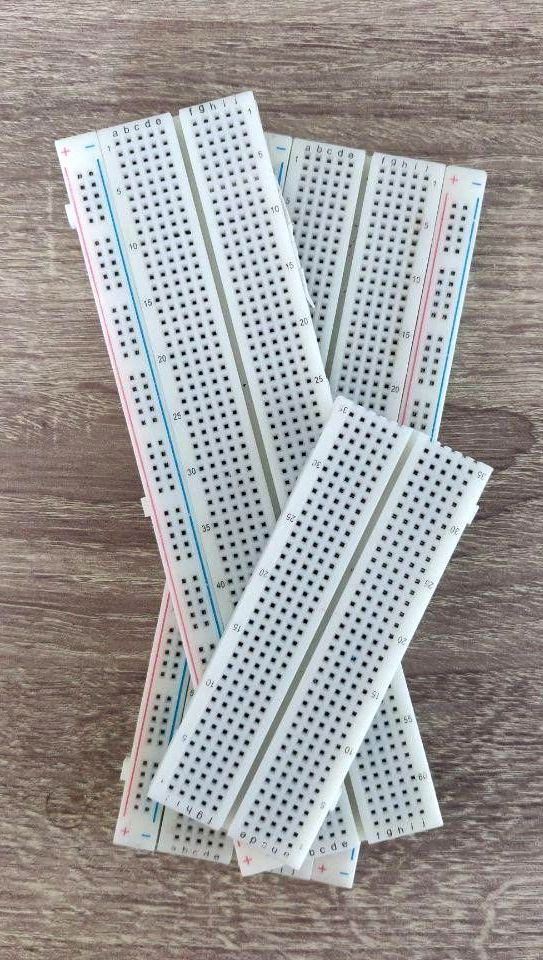
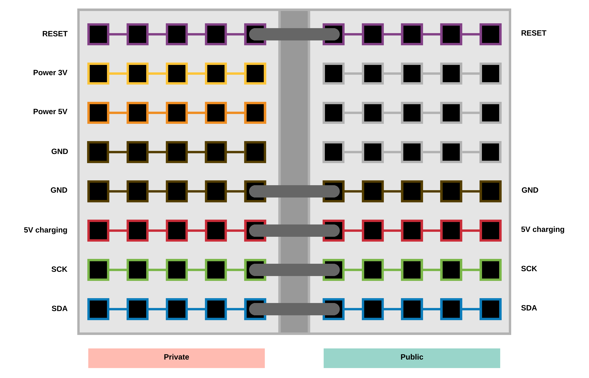
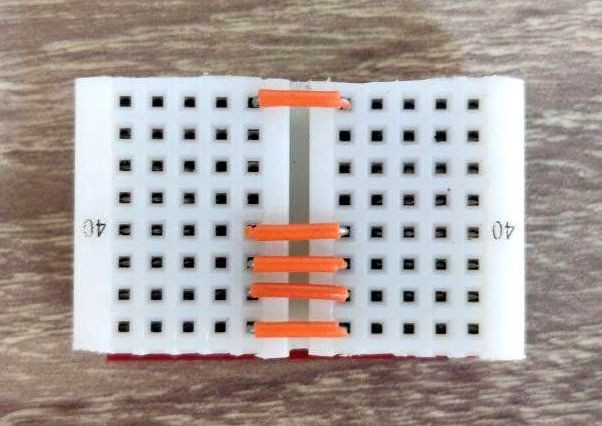
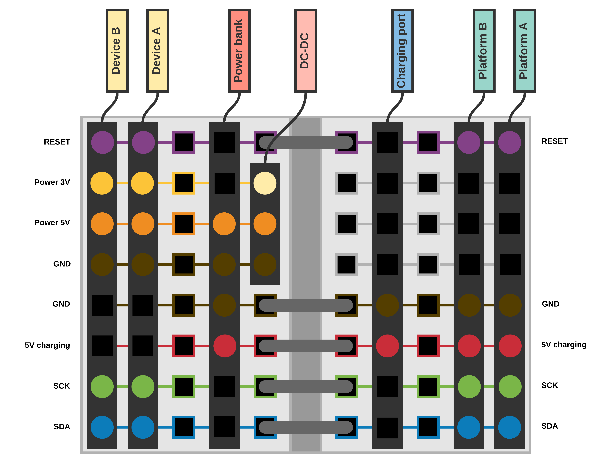
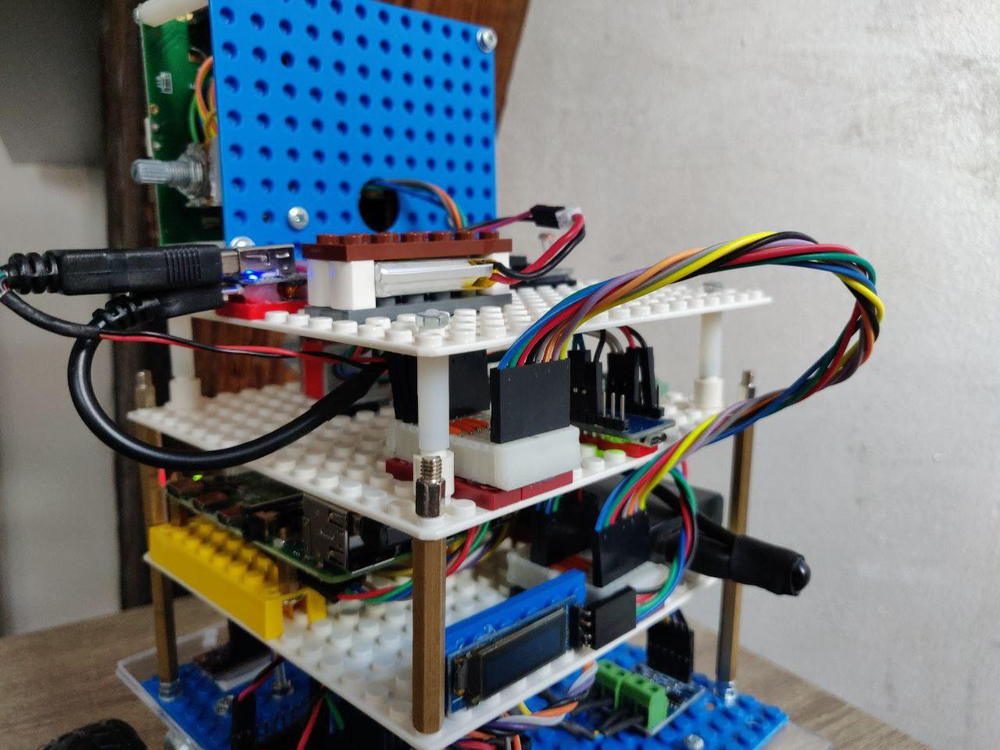

There are a lot of issues when you connect low- and high-current devices to the same electrical circuit. Basically, you are getting:

- Noise at sensors' output

- Freezes and resets of MCUs

- Artefacts on LCD and backlight's flashing

- Other unexpected issues

That's really annoying that's why I spend last several weeks thinking how to implement power supply for Zakhar. There are two things I want from this update: to avoid things mentioned above and to simplify development allowing me to work with every platform separately. There is also thing that I don't want, to develop a reliable power system. Please get me right, it is cool and interesting, but it is not something new. So, what I want is:

- Use as many ready-to-use components

- Make an isolated power supply system for each platform

Sounds like power banks!

I've been already using a cool power bank with two low- and high-current ports for motors and the rest electronics:

I will use it for the moving platform only.

One months ago, I've already added another one for the computing platform with a Raspberry:

Since the face module and the sensor platform haven't been separated almost never during the development, I decided to add to them only single common power bank. Unfortunately, I haven't found anything, so I had to make own one:

(I know, LEGO AGAIN!)

Okey. Now I must charge 3 power banks. Easy! Since we are not interested of using four pins of inter-platform connectors for power delivery anymore it's time to update the connectors for delivery of charge to power banks.

Again, to not spending the time for development of physical connectors, let's use best practices.

1. Take breadboards:

2. Think a little

3. Cut!

And here what and how we can connect:

As a result, two platforms connected look like:

And no more blinking of LCD backlight while the Raspberry is thinking, or motors are turning!

I'm waiting a bunch of cables and switchers so next time I'll show the final variant of Zakhar's power supply solution and we, having a stable and plug-and-play set of flatform will continue to investigate the life behavior and how to implement it for the robot!

Stay tuned!

P.S If you have any better solutions let me know!
