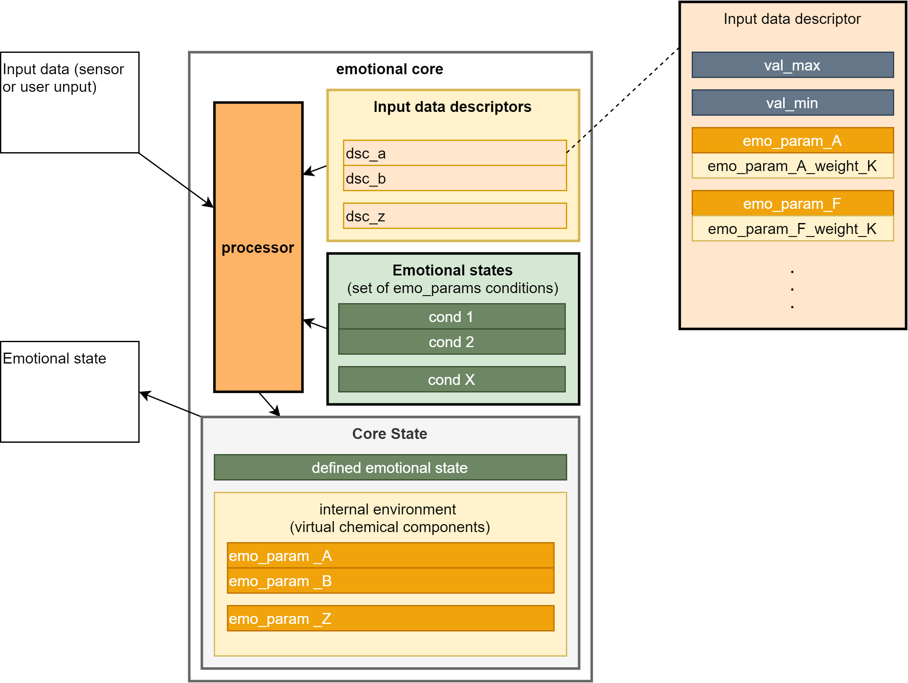

Well, [the third milestone is in progress](https://github.com/an-dr/zakhar#milestones).

It's time for the most interesting part of the project - emotions and reflexes. Now, let's talk about emotions, but in short.

In my view and my understanding of what should be going on here, emotions - it is just the name of our mental state. We are going to have a set of such emotional states - to use those states as a simple indicator for our systems using my emotions implementation.

In the animal case, each state is defined by the specific chemical condition of the brain. The virtual analog of those chemical components probably should be a set of parameters.

Input sensorial data could affect the parameters with different weights. E.g. the huger amount of light should decrease the parameter reflecting the level of anxiety.
If the level of anxiety is low enough, we could declare that the code in a calm state.

The pretty rough structure of the emotional core is on the picture:

The work is going at the branch of my r_giskard repository, where I'm going to implement and the core and the simulator to test it on desktop systems:

<https://github.com/an-dr/r_giskard/tree/feature/simulator>

I'm implementing it in C++ because in that scenario the core would be used in embedded systems as well as in python programs.
