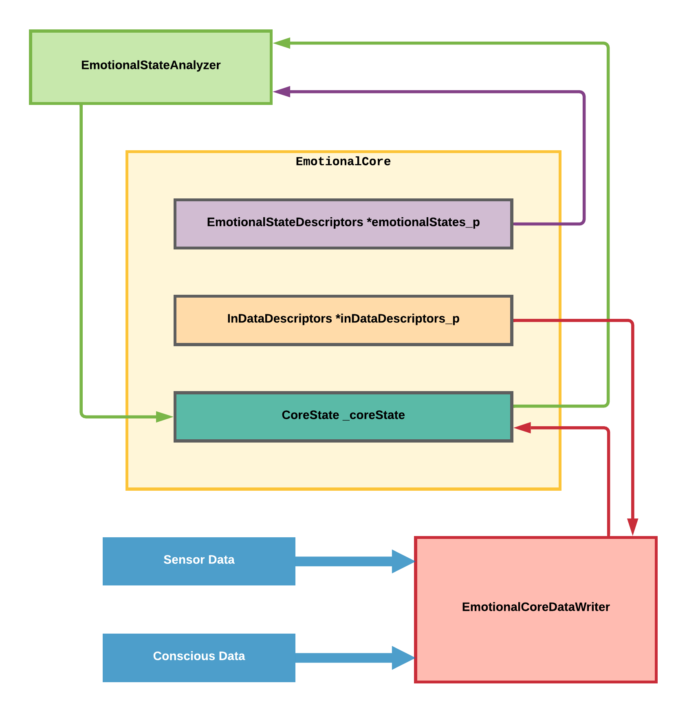
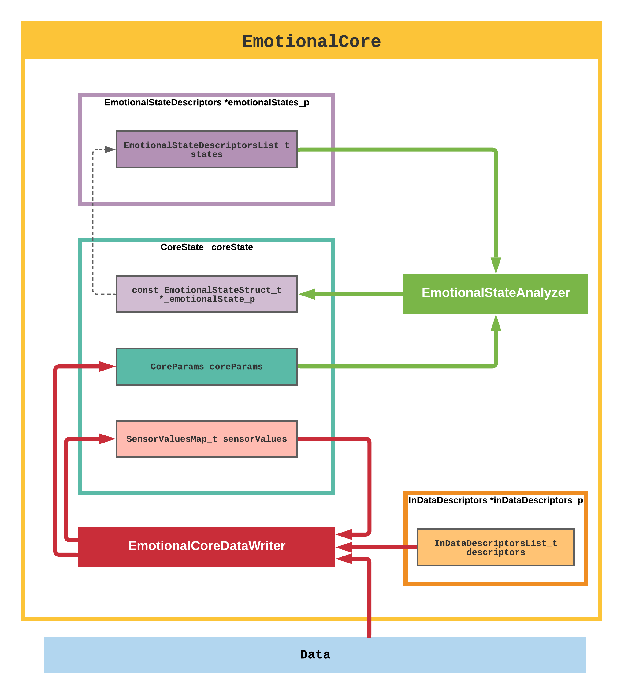

Now after some polishing of the basic emotional core I can tell about how it works and about it's structure.

Emotional core consists of three main parts (see the picture bellow):

* Input Data Descriptors - describes data from sensors and how it should affect the core
* Emotional States Descriptors - named states of the core described by specific values of core parameters
* Core State - contains core parameters, value of sensors and pointer to relevant to parameters Emotional  States Descriptors

Or more detailed:

<!--more-->

When you write the data, the core does the following:

- updates saved sensor value
- updates core parameter: param += (new_sens_val - old_sens_val) * weight
- updates the current core state based on updated parameters

Here are some examples of data that could be used with the core.

Example of core parameters:

[ "cortisol",

 "dopamine",

 "adrenaline",

 "serotonin" ]
Example of a core's emotional state:

{

 "name": happiness,

 "conditions": [

 {

 "param": "cortisol",

 "op": LESS_THAN,

 "value": 10

 },

 {

 "param": "serotonin",

 "op": GREATER_THAN,

 "value": 100

 }

 ]

}
Example of input data descriptor:

{

 "sensor_name": "temperature sensor",

 "val_min": 0,

 "val_max": 255,

 "weights": [

 {

 "core_param_name": "serotonin",

 "weight": 0.5

 },

 {

 "core_param_name": "cortisol",

 "weight": -0.5

 }

 ]

}
Input data example:

{

 "sensor_name": "temperature sensor",

 "value": 120

}
My next step will be in looking appropriate parameters and weights that can adequately describe (roughly of course) some human emotions.

Source core: <https://github.com/an-dr/r_giskard>
