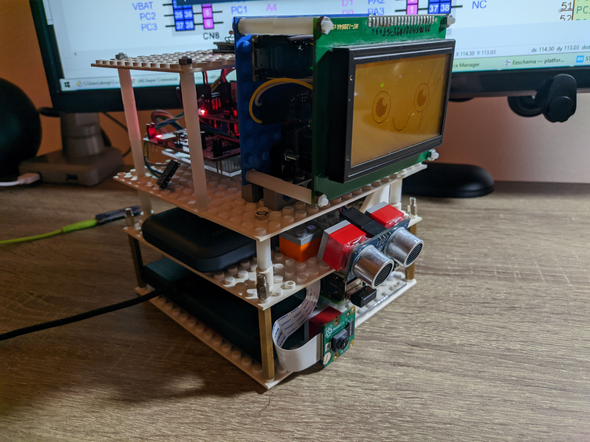
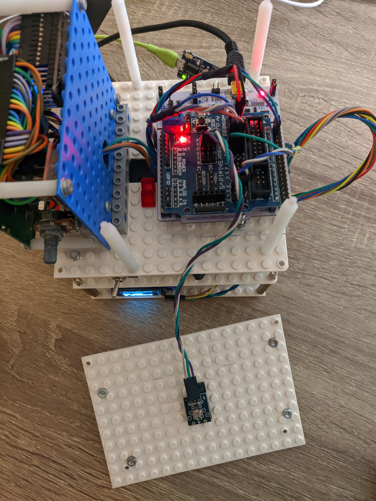
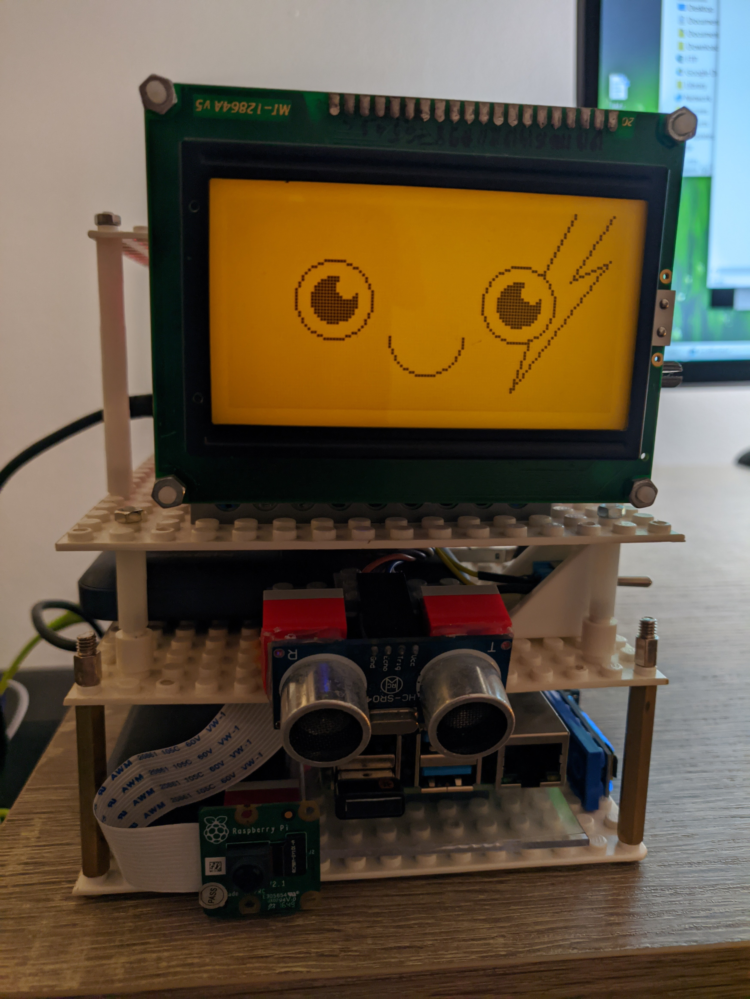

Done! Now sensors data is collecting by a powerful STM32 MCU with FreeRTOS. This will help adding even more sensors. For now, there are two:

* [Ultrasonic Distance Sensor - HC-SR04](https://www.sparkfun.com/products/15569)
* [KY-018 Photoresistor Module](https://arduinomodules.info/ky-018-photoresistor-module/)

Here is a video of the update in action:



Links:

* [Updated source code with STM32 support](https://github.com/an-dr/zakhar_sensors/tree/ebcc7f652904122da11c9facf0f1f92af8f6b9fe)
* [Repository of my SharedVirtualRegisters library that I used in the update](https://github.com/an-dr/SharedVirtualRegisters) - it is thread-safe and supports FreeRTOS, but can work without any OS as well
* [Repository of the logging library](https://github.com/an-dr/log.cx) - it is a fork of the [log.c library](https://github.com/rxi/log.c) by rxi.

Photos bellow.

