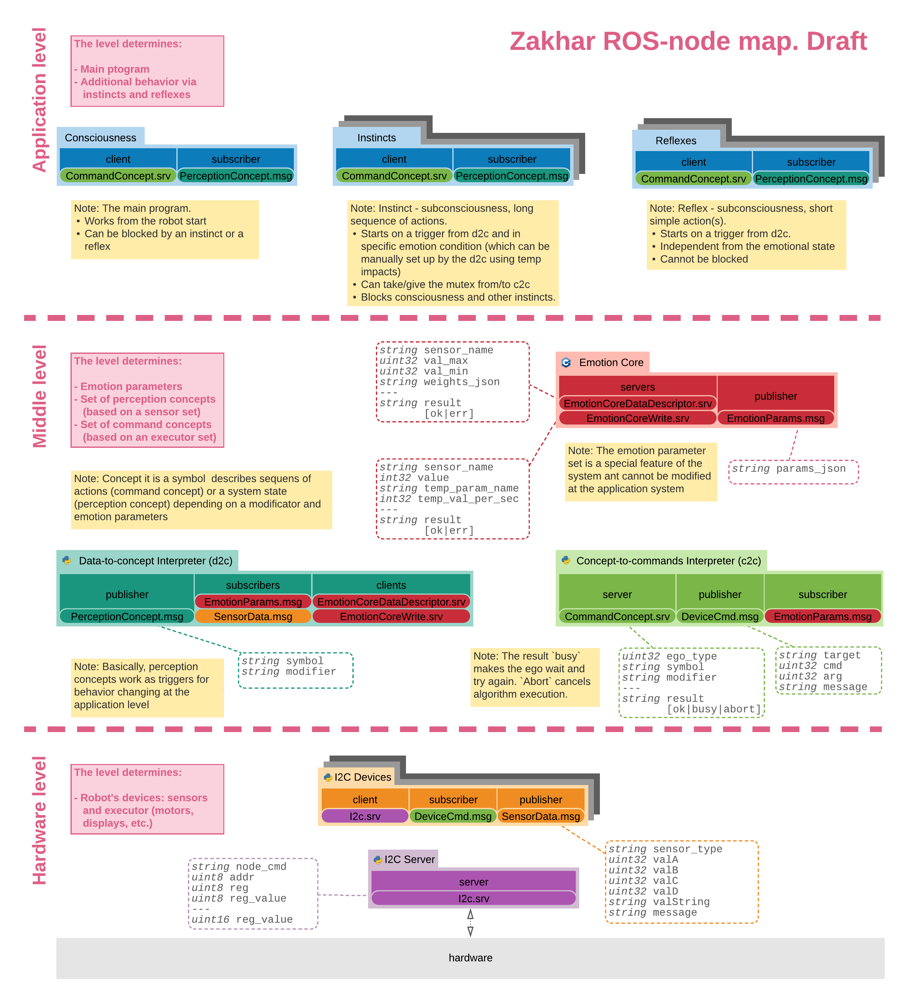

Working on the Emotion Core update it became clear to me that [placing responsibility of emotional analysis to Ego-like nodes](https://hackaday.io/project/171888-zakhar-the-robot/log/188030-draft-of-the-updated-ros-node-network-with-the-emotional-core) (a Consciousness, Reflexes, and Instincts) is a wrong approach. It leads to the situation where the developer of the application should specify several types of behavior themself, which is too complicated for development.

I want to implement another approach when concepts themselves  contain information about how they should be modified based on a set of the emotion parameters. For example:

1. An Ego-like node sends the concept `move` with a modifier `left`:

```json
{
    "concept": "move",
    "modifier": ["left"]
}
```

2. The concept `move` contains a descriptor with information that: if adrenaline is lower than 5 - add a modifier `slower`

3. The Concept-to-command interpreter update the concept to:

```json
{
    "concept": "move",
    "modifier": ["left", "slower"]
}
```

4. According the concept descriptors the Concept-to-command interpreter sends commands to the device Moving Platform:

* [Set speed to 2](https://github.com/an-dr/zakhar_platform/blob/master/software/main/src/controlcallback.cpp#L36) (3 is maximum for the device)
* [Move left](https://github.com/an-dr/zakhar_platform/blob/master/software/main/src/controlcallback.cpp#L29)
* [Set speed to 3](https://github.com/an-dr/zakhar_platform/blob/master/software/main/src/controlcallback.cpp#L37) (default value)

In addition, I updated the diagram itself by structuring it and adding notes to make the entire system easier to understand. Here is the diagram:


Now I will implement the structure above in the [emotion_core](https://github.com/an-dr/zakharos_core/tree/feature/emotion_core) branch of the zakharos_core repository. The feature is getting closer to implementation. More updates soon.

Links:

<https://github.com/an-dr/zakharos_core/tree/feature/emotion_core>

<https://github.com/an-dr/r_giskard_EmotionCore>
