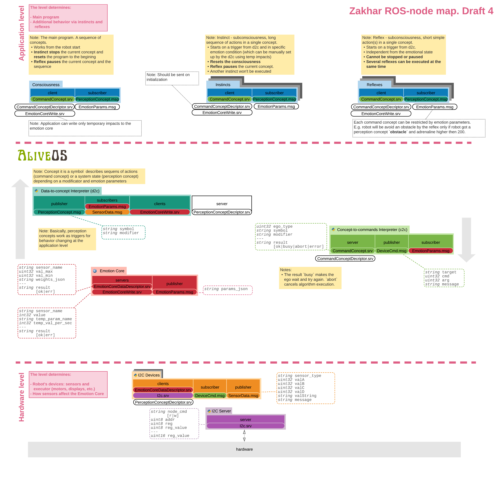

So, indeed, the more I develop the software for Zakhar, the more complicated it goes. So, first:

**Contributions and collaborations are welcome!**

If you want to participate, write to me and we will find what you can do in the project.

Second, feature branches got toooooo huge, so I'll use the workflow with the develop branch ([Gitflow](https://www.atlassian.com/git/tutorials/comparing-workflows/gitflow-workflow)) to accumulate less polished features and see some rhythmic development. Currently, I'm actively (sometimes reluctantly) working on the integration of my [EmotionCore](https://github.com/an-dr/r_giskard_EmotionCore) to the Zakhar's ROS system. So now, the last results are available in the `develop` branch:

<https://github.com/an-dr/zakharos_core/tree/develop>

Third, to simplify the development of the robot's core software I would like to separate really new features from the implementation. So, Zakhar will be a demonstration platform and the mascot of the project's core. The core I'd like to name the AliveOS, since implementation of the alive-like behavior is the main goal of the project. I am not sure entirely what the thing AliveOS will be. It is not an operating system so far, rather a framework, but I like the name :).

Fourth and the last. Usually, I write such posts after some accomplishment. That's true and today. I just merged the [feature/emotion_core](https://github.com/an-dr/zakharos_core/commit/0dedc96056a619cac51373bb9638a029522e7753) branch to the develop one (see above). It is not a ready to use feature, but the core is working, getting affected by sensors and exchanging data with other nodes. It doesn't affect the behavior for now. For this I need to make some huge structural changes. The draft bellow (changes are in black and white)

Next steps:

1. Implementing of the new architecture changes
2. Separation of the core packages into the one called AliveOS
3. Moving AliveOS to the separated repository and including it as a submodule (the repo already exists: <https://github.com/an-dr/aliveos>)

Thank you for reading! Stay tuned and participate!
