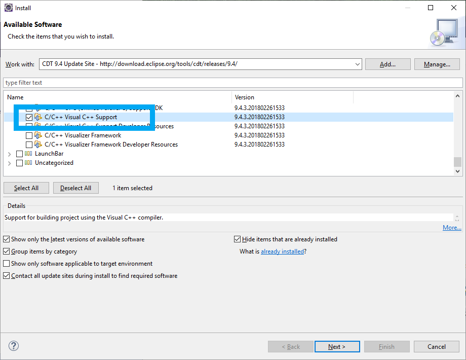
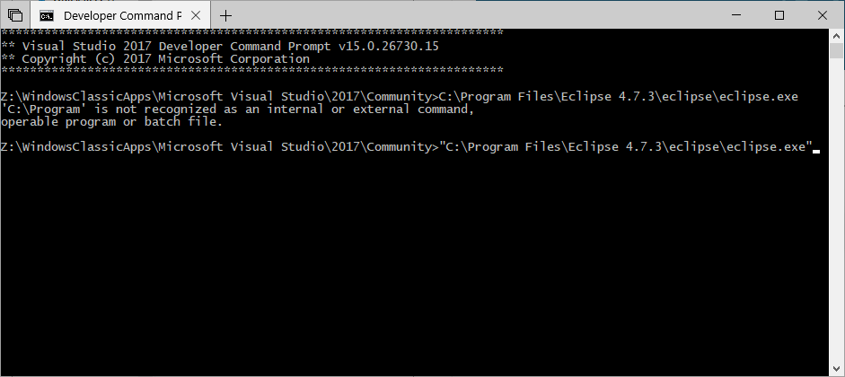
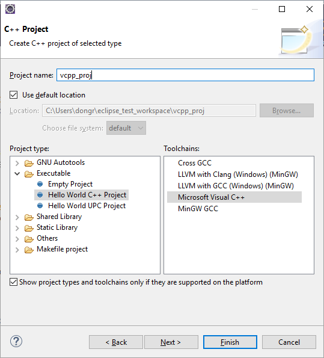
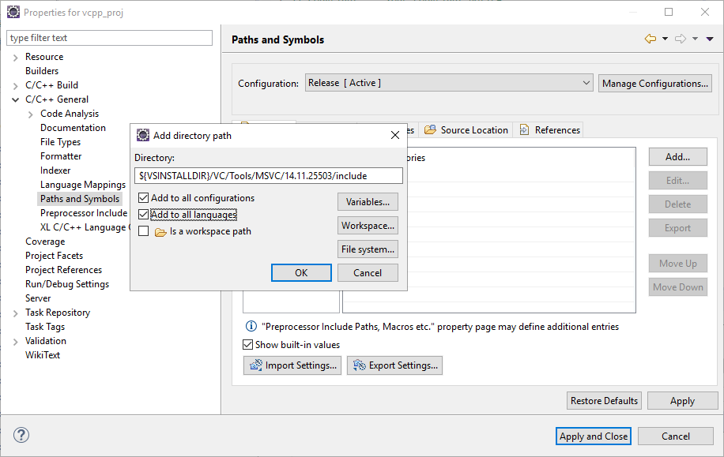
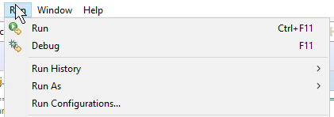
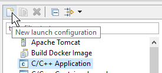
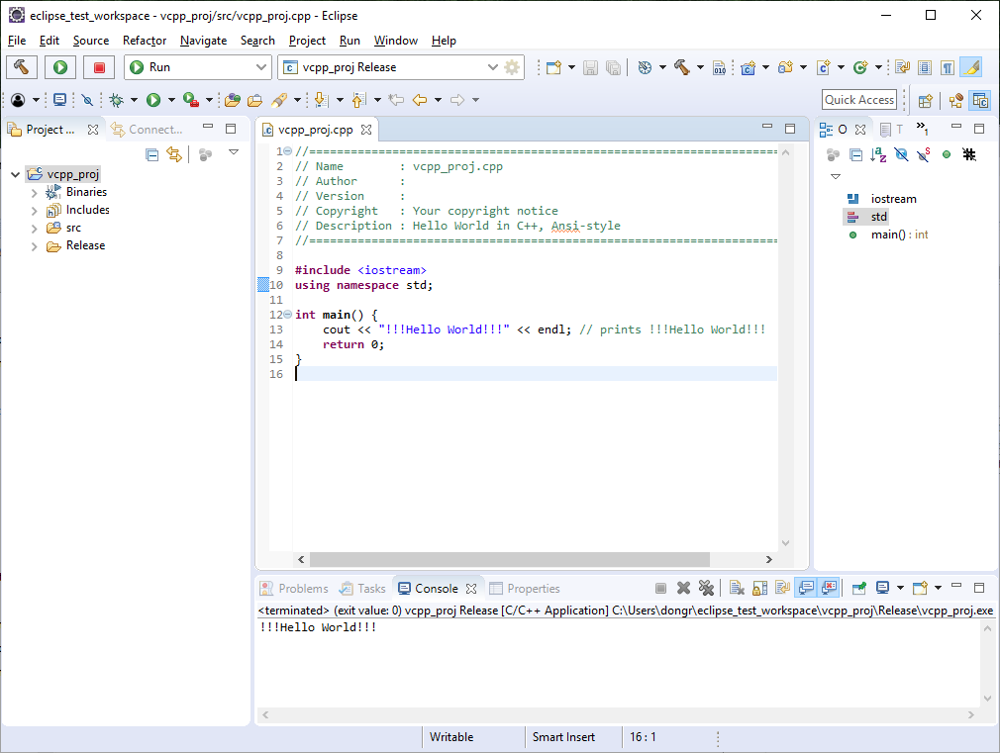

1\. Install software:

- [Eclipse IDE for C/C++ Developers](http://www.eclipse.org/downloads/packages/eclipse-ide-cc-developers/oxygen3a)

- [Visual Studio](https://visualstudio.microsoft.com/downloads/)

2\. **Open** Eclipse -> Help -> Install New Software... ->

Work with: `http://download.eclipse.org/tools/cdt/releases/9.4/` ->

CDT Optional Features -> C/C++ Visual C++ Support 9.4.3.201802261533

\-> Next -> Agree -> Install -> Finish -> Restart

3\. **Close** Eclipse

4\. **Open** Developer Command Prompt for VS 2017 and run from it Eclipse (this trick will add all needed VS environment variables to path)

5\. Create new C++ project

6\. Open Project Properties

C/C++ General -> Paths and Symbols -> Includes -> Add... ->

>  `${VSINSTALLDIR}/VC/Tools/MSVC/14.11.25503/include`

\+ Add to all configurations

\+ Add to all languages

7\. Ok -> Apply and Close -> Yes

8\. Build

9\. Run -> Run configurations

- 
- C/C++ Application ->
- Run

10\. Done!

