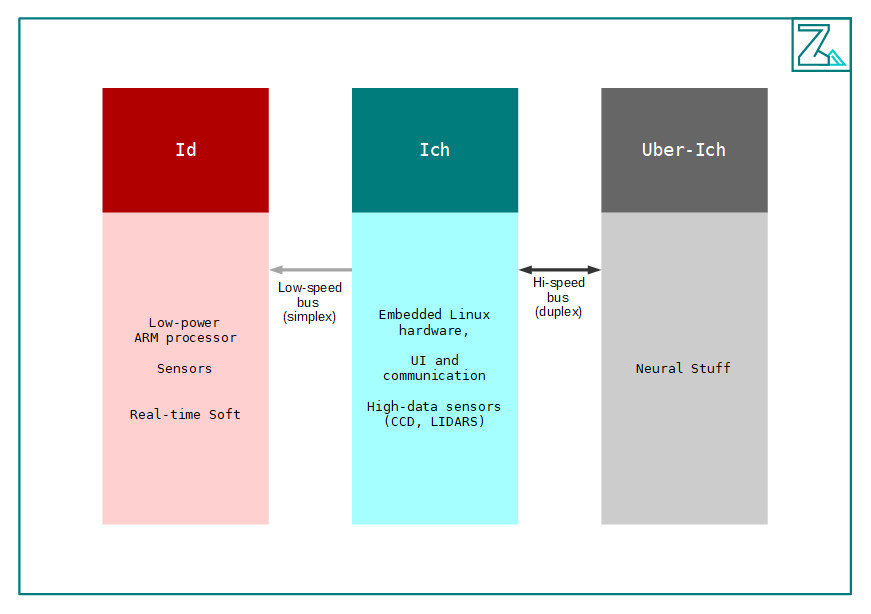

Today I decided to present my small robotics project. I called it Zakhar. It is not really a robot of flesh (though, sometimes I'm assembling different prototypes).  it is a research project where I develop new interesting ways in robotics architecture.

The project is full of abstractions and parallels with human psychology. The main aim if the project is to create a robot(s), which behavior would be understandable and familiar to a human as an observer.

The reason why it is interesting:
<!--more-->
- it helps me to understand myself and other people
- it could help to break some border in the human mind which split into a natural and humanitarian perception of the world
- it is an interesting challenge for almost all my living and professional experience

My current thoughts in about to get Freud's trinity conception as the basis and in this terms, the functional scheme should look like this:

You could follow my progress on

- [GitHub](https://github.com/dongrama/zakhar)
- [Zakhar project page](https://agramakov.me/wiki/doku.php?id=zakhar)
