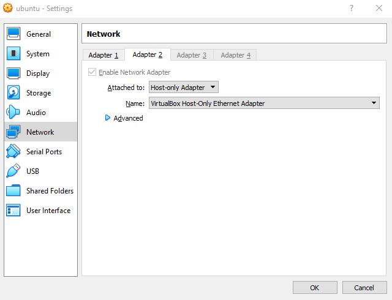

Here is how to work with Linux inside a virtual machine from Windows using ssh client and VirtualBox. If you will use any command line ssh client you could use all Linux functions right inside your standard Windows Command Line

## 0 Setup Software to the Host

Set up VirtualBox, VirtualBox Extension and Ubuntu Server Edition (or Ubuntu Desktop) in a regular mode. I called the machine just: "ubuntu"

<!--more-->
## 1 Add VirtualBox setup directory to the PATH variable

`setx /M path "%path%;"C:\Program Files\Oracle\VirtualBox\""`

Note: C:\\Program Files\\Oracle\\VirtualBox\\ could be differs

## 2 Set up a VM network

Virtual Machine Settings -> Network -> Adapter 2 (tab) -> Attached to: -> Host-only adapter-> OK (button).



## 3 Setup ssh server on the Ubuntu VM

Run the virtual machine

Open a Linux terminal and write:

`sudo apt-get install openssh-server nano net-tools`

### (Optional) Config the SSH server

In a Linux terminal (guest ubuntu):

`sudo nano /etc/ssh/sshd_config`

And restart SSH server:

`sudo systemctl restart ssh.service`
 

### (Optional) Set up a non-gui mode

If you set up Ubuntu Desktop you could turn off GUI at startup to reduce the resource consumption. Even more it is not needed working through a console. In a guest terminal:

`sudo systemctl set-default multi-user.target`

To turn on GUI again use:

`sudo systemctl set-default graphical.target`

# 4 Check your local VM IP

`ifconfig`

It should be something like `192.168.56.101`, in my case, at least

# 5 Close the Virtual Machine

Do it.

# 6 Run VMbox from CMD

`VBoxManage startvm "ubuntu" --type headless`

Instead "ubuntu" you should use your VM name

# 7 Connect to Ubuntu via any SSH client

For example, right from Command Line via ssh from [cygwin](http://www.cygwin.com/):

`ssh user@192.168.56.101`

Note: change `user` to your username in guest's VM and `192.168.56.101`to IP which we checked on the 4th step

# 8 Use it!

For example like there: [https://docs.espressif.com/projects/esp-idf/en/latest/get-started/linux-setup.html](https://docs.espressif.com/projects/esp-idf/en/latest/get-started/linux-setup.html)

### (Optional) Connect USB device to your working VM

In the host cmd get the list of devices:

`VBoxManage list usbhost`

Connect via UUID:

`VBoxManage controlvm ubuntu usbattach f8a9f295-e221-49b0-97a5-aec55d6a2c8c`

# 9 Stutdown** **VMbox when you've done

`VBoxManage controlvm "ubuntu" poweroff --type headless`

### (Optional) Mount Ubuntu Home as a drive

A. Install [SSHFS-Win](https://github.com/billziss-gh/sshfs-win)

B. Open **File Explorer** \-> right-click on **This PC** -> **Map network drive** -> in the **Folder** field:

`\\sshfs\remoteUser@remoteIP`

### (Optional) Set up a shared folder

A. Inside the host:

A1. `VBoxManage sharedfolder add ubuntu --name esp-repos -automount -hostpath C:\esp\repos`

B. Inside the guest:

B1. 

```sh
sudo mkdir $HOME/host-share/esp-repos
sudo touch /etc/init.d/vboxmount
sudo nano /etc/init.d/vboxmount
```

B2. Insert:

```sh
sudo mount -t vboxsf esp-repos /home/agramakov/host-share/esp-repos/
```

B3. Register start script:

```sh
sudo chmod 755 /etc/init.d/vboxmount
sudo update-rc.d vboxmount defaults
```

### (Optional) Read more about

[working with VirtualBox without GUI](https://www.virtualbox.org/manual/ch08.html)
