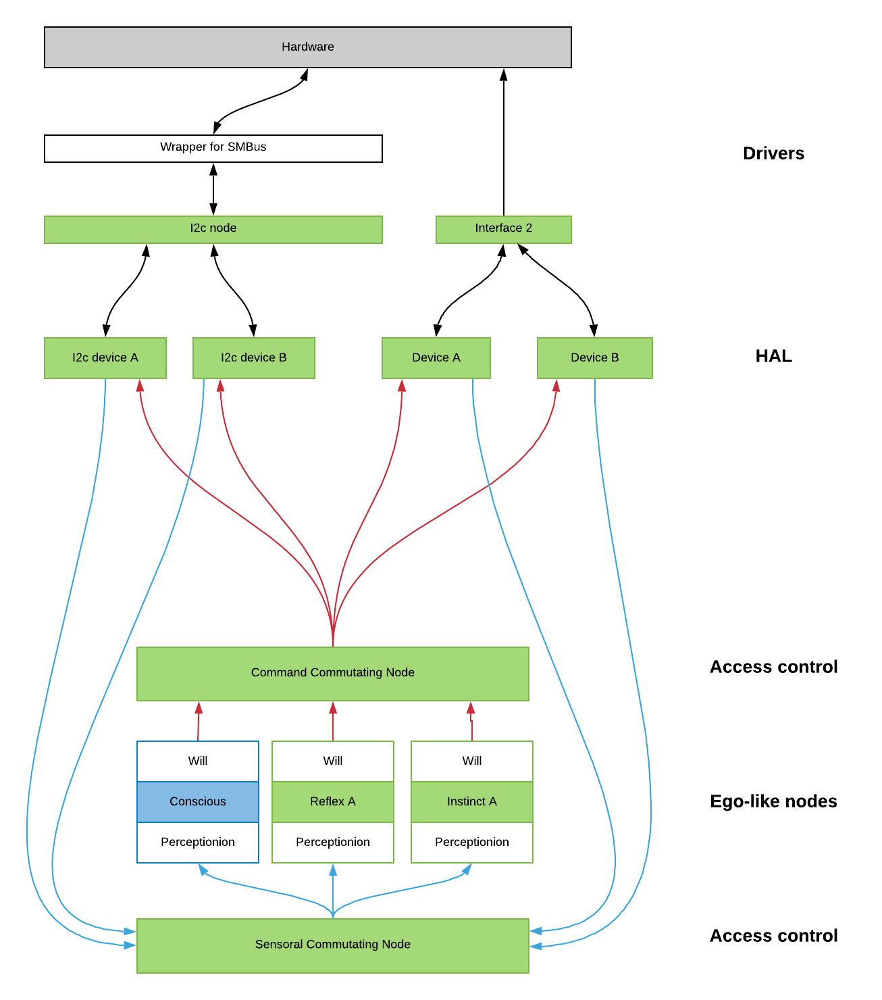

The first experiments with ROS showed that it probably will help a lot in building mind-like organized programs.

Node-based conception and server-client interactions hopefully allow me to think less about queues, threads, and access control, which took the most of the time during building the first demo on bare Python.

Here are some ideas of the mind-like program architecture. I probably will working on it next weekend.

Colored blocks are nodes
