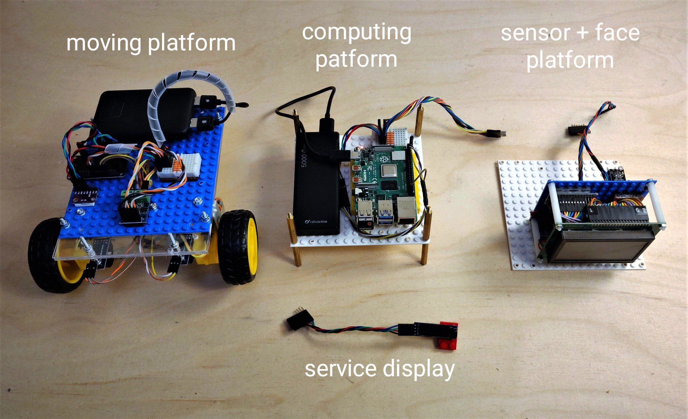
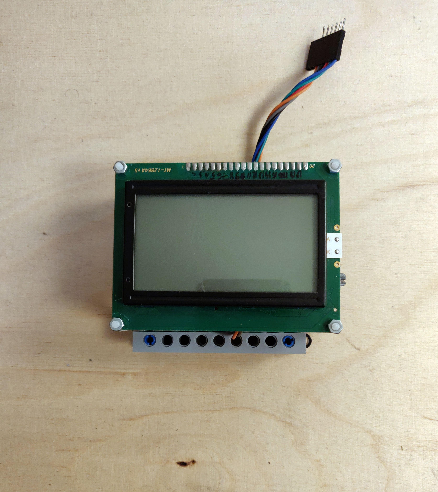

While the robot is changing all the time, after the last update I've decided to take some snapshot of its current state and show to the public what's going on now. Let's start:

Zakhar consists of three (sometimes four) platforms and a service OLED display. I'm using the last one for debugging, testing, etc.

<!--more-->
**Moving platform**

The moving platform just got the update with ESP32-board as a replacement for old Arduino and with the MPU module

I did it for the sake of better multitasking which is needed to me for simpler handling of data from sensors and commands from the computing platform.

The platform is carrying on a power bank which supplies motors of the platform and all other electronics of Zakhar (except Raspberry Pi).

The power, as well as commands, are transmitting through unified 8-pin connectors (2 pins for I2C, 2 pins for 5v of low current, 2 pins for 5v of high current, 2 pins - reserved)

**Computing platform**

The computing platform has Raspberry Pi 4B with 4Gb of RAM and it's own power bank - for a stable supply of the Raspberry.

**Face+sensor platform**

The platform is carrying an Arduino which performs as an I2C device with data collected from sensors (i have only one now) into I2C registers and the face module.

Inside the face module, there are another Arduino and a DC-DC convertor (for LCD supplying)

That's it, thank you for your attention!

I'm going back to writing the firmware for ESP32. CU soon!
