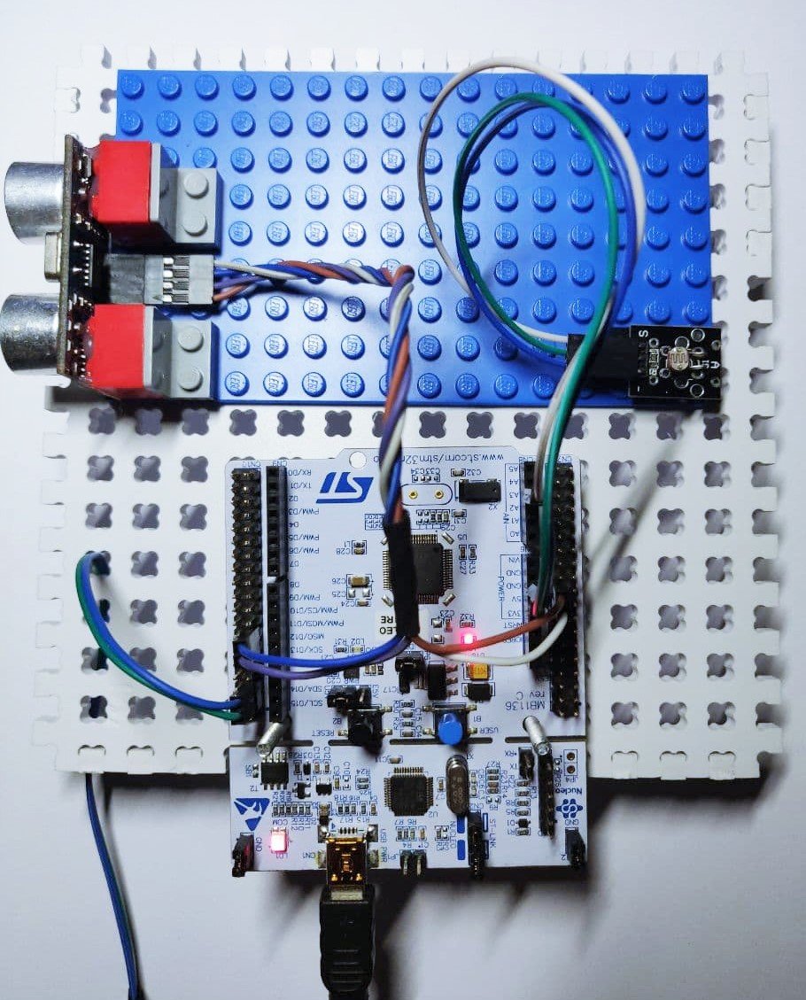
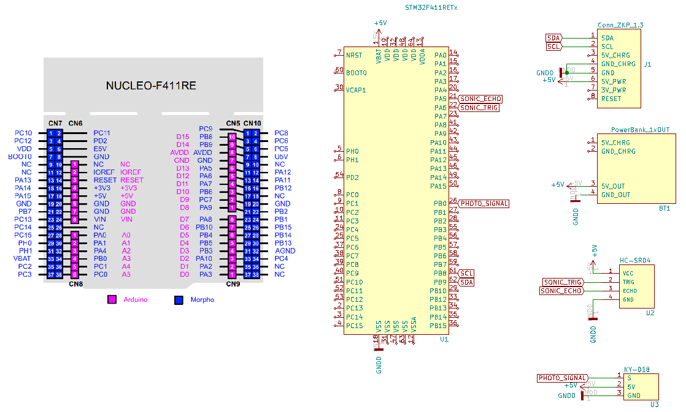

It's a good night to move the sensor platform to a new MCU and add some sensors to demonstrate working of the [emotional core](https://github.com/an-dr/r_giskard/tree/master/emotional_core) ([roadmap](https://github.com/an-dr/zakhar#milestones)).

PR for the update (WIP): <https://github.com/an-dr/zakhar_sensors/pull/4>

