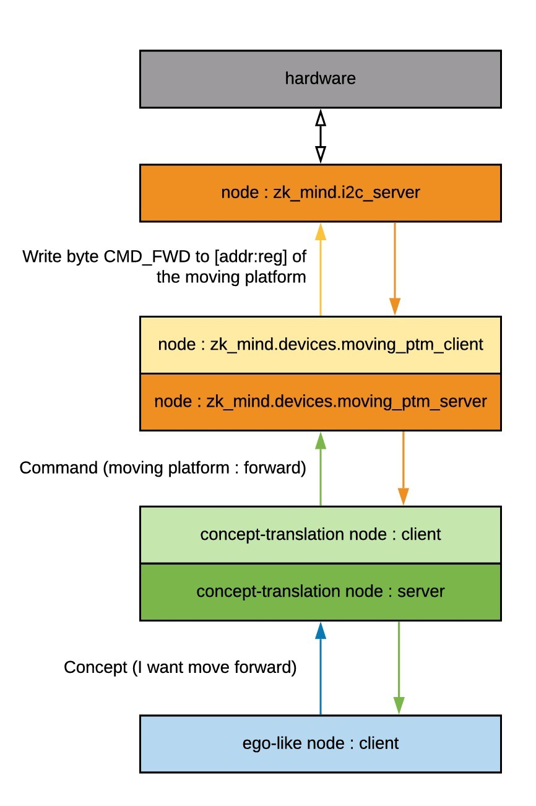

I'm trying to reverse engineer myself and apply it to the Zakhar. Some points:

1. I can't send a direct order to, let say, my hand
2. I must form a concept, like "fold fingers into a fist" or "move the hand up"

What that's mean for Zakhar:

* The main program should use high-level commands or concept
* It is needed one more node translating these concepts into commands for devices

Possible in-program interaction using terms of ROS and Zakhar should be like:

The thoughts are related to:  <https://github.com/an-dr/zakharos_core>
