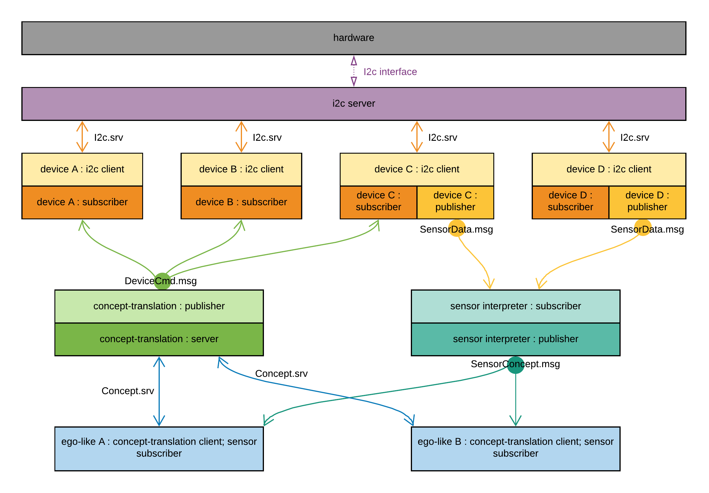

I'm about to finish migration to the ROS. Aside small things, architecture seems crystalized. It looks like following:

Every block represents ROS-node (except the hardware block). Interaction between blocks is trying to mimic a real brain (as I understand what is happening there).

I'm lazy to describe every node right now, I will write an article when this work will end up with the [second demo](https://github.com/an-dr/zakhar#milestones). But if you interested you can check the code out in the repository here:

<https://github.com/an-dr/zakharos_core>

More about ROS: <http://wiki.ros.org/>
