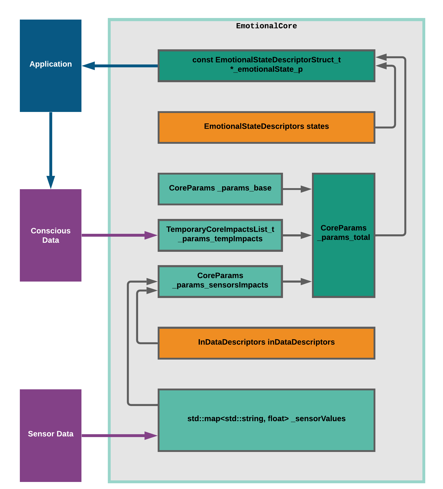

Just finished a huge update for the Core. New feature is temporary impacts. It simulates a situation, that you can get watching [a screamer](https://www.youtube.com/watch?v=BpmTtWC5BJU) (Caution! ). Something scarry is happening, you are getting a lot of adrenaline and cortisol, after 5 minutes you are ok.

Also, the structure of the core was dramatically simplified. On the picture temporary impacts are called Conscious Data because I'm going to use it to simulate "bad thoughts" of the robot.

Update is here (there is an example you can try :) ):

<https://github.com/an-dr/r_giskard/tree/4e7e5115e7975b12e065ffd98130c0e9ba97f551/emotional_core>
