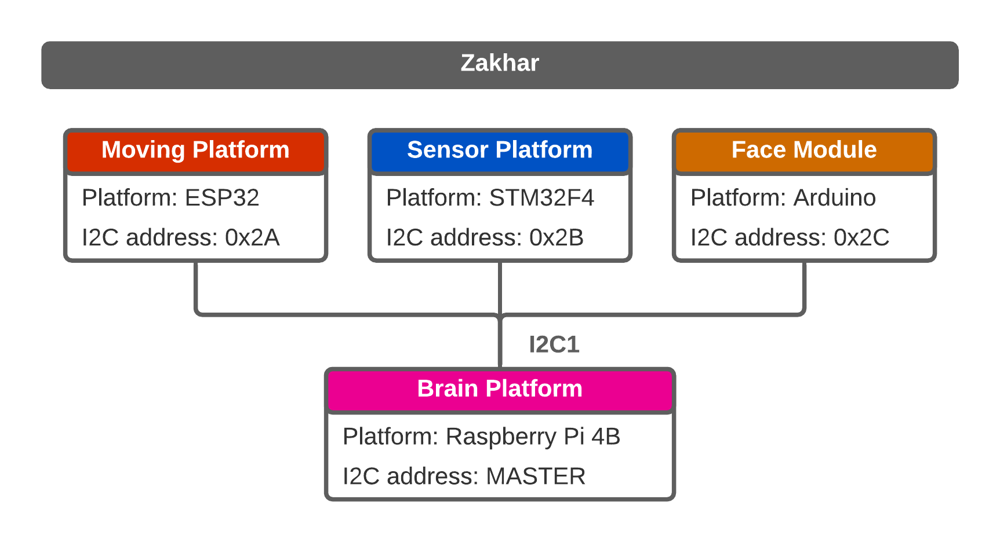
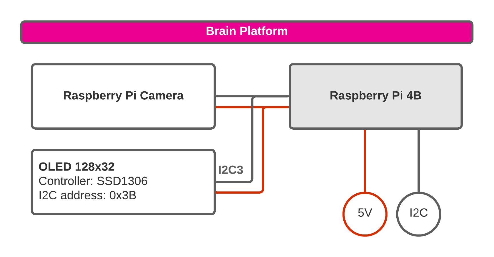
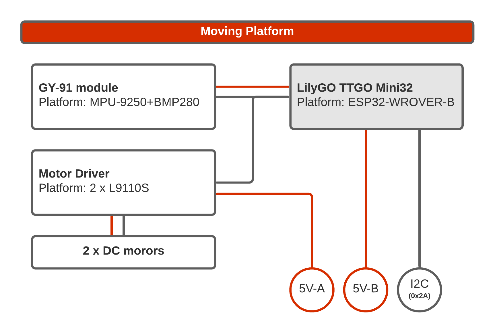
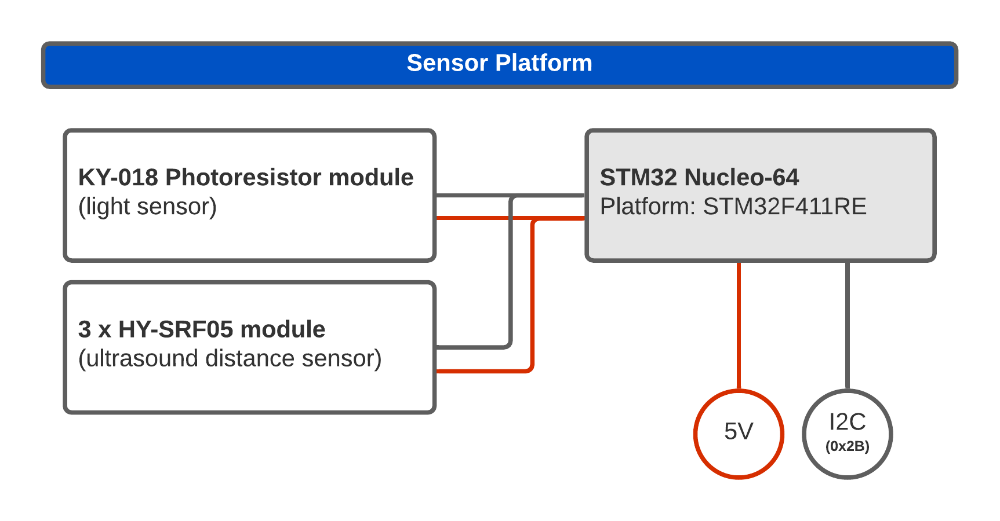
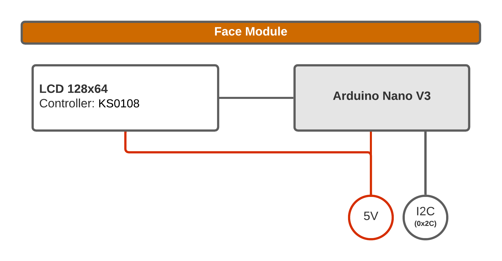

Just added illustrations describing hardware used in the project to the repository:

<https://github.com/an-dr/zakhar/tree/ec7c4e69af0f5b44aa3dde2fd7766416ac783668>

Here are the pictures:

And detailed for each device:

<!--more-->

