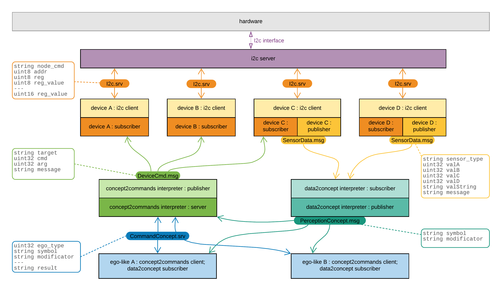

Hi! I merged a huge update for [zakharos_core](https://github.com/an-dr/zakharos_core) - the main part of the Zakhar project.

The repository is a [Robot Operating System](http://wiki.ros.org/) network where the main application consists of ego-like nodes: the consciousness (the main application) and instincts (interruptions). Each of them operates with concepts in the manner as our mind works.

As I already said, my aim is to make a robot that behaves like an animal, and hence having more understandable for the user behavior.

After this update the next step is to integrate my already developed [emotional core](https://github.com/an-dr/r_giskard/tree/master/emotional_core) , which is basically an attempt to recreate the endocrine system of alive organisms.

Returning to the update. Currently the robot uses three ego-like nodes:

- node-consciousness: the Small researcher - robot is moving by circles.
- instinct: Bird Panic - analyzing light changing patterns to recognizing a single moving fast shadow, then put the robot in the panic state, when it is trying to find a darker (safer) place.
- instinct: Avoid Close Objects - every object closer then 5 cm should be avoided. Object in front leads to moving backward. Objects at sides activate the algorithm: move back, turn on 60 degrees.

The ROS-network is shown on the picture bellow. Also have a look at the robot in action on a video. Thanks!


