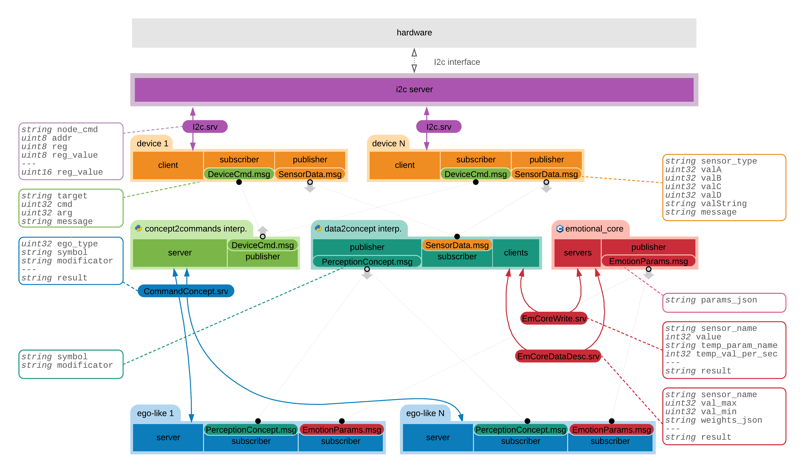

Complexity of the networks is getting increased in a non-linear manner with any new type of node added, so documentation of the development is becoming more crucial than ever. So, I've decided to, firstly redraw the network diagram to make it easier to read and contain more useful information. Then I've spent some time on how the [Emotional Core](https://github.com/an-dr/r_giskard/tree/master/emotional_core) should interact with other nodes.

Initially, I thought that naming each condition based on a set of emotional parameters is a clever idea. With that approach, we would only send the name of the emotion to the main program and that emotion would affect the robot behavior. But it leads to the situation when the robot has a set of discrete states, in other words, I would develop a pretty sophisticated state machine - and it is way far from how the animals behave.

Analyzing my feelings, I also cannot say that the name of emotions defines my behavior, I would say that it is rather an uninterrupted specter of states. So, it would be that the researches of [Carroll Izard](https://en.wikipedia.org/wiki/Carroll_Izard) and his colleagues in distinguishing human emotions I've read a lot last months are not applicable to my project. As well as the part of the Emotional Core responsible for changing emotions depending on a set of emotional parameters. A bit sad about spent time, but it is the development process.

So now I have a draft of the structure I will use integrating the Emotional Core into the mind of Zakhar.

