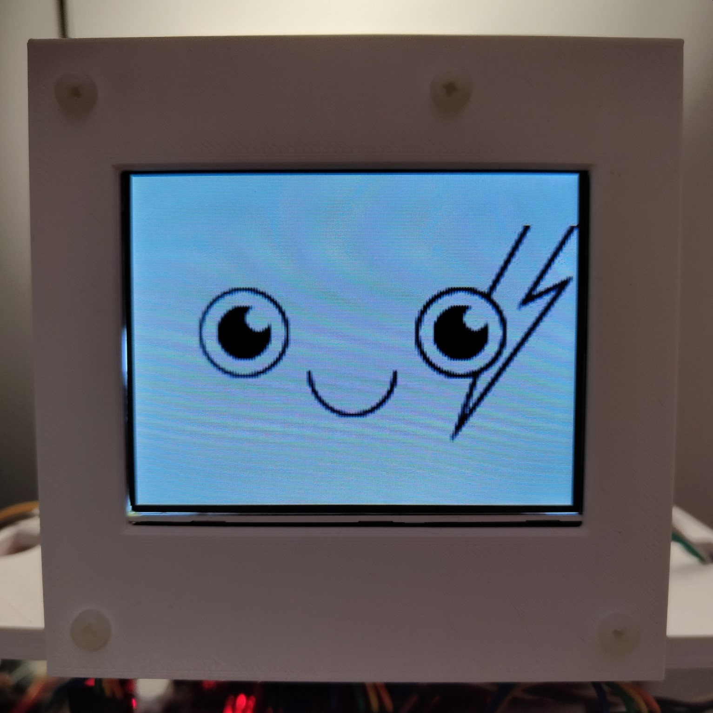

The new Unit is based on the ESP-Wrover-Kit and uses a TJA1050 module for CANbus communication.

It is compatible with the qCAN protocol (described on the Zakhar main page) and can show 5 facial expressions: Anger (0x32), Sadness (0x34), Pleasure (0x33), a Blink (0x31), and Calm (0x30).

<!--more-->
To control it you should send a CAN message with an expression code using a 125Kbit standard CAN frame and with the message id ending with byte 0x4. E.g. send a message with ID: 0x004, data: 0x33 to make Zakhar happy 😍.

[Read more on the Zakhar main page](https://zakhar-the-robot.github.io/doc/docs/systems/io/face/).
