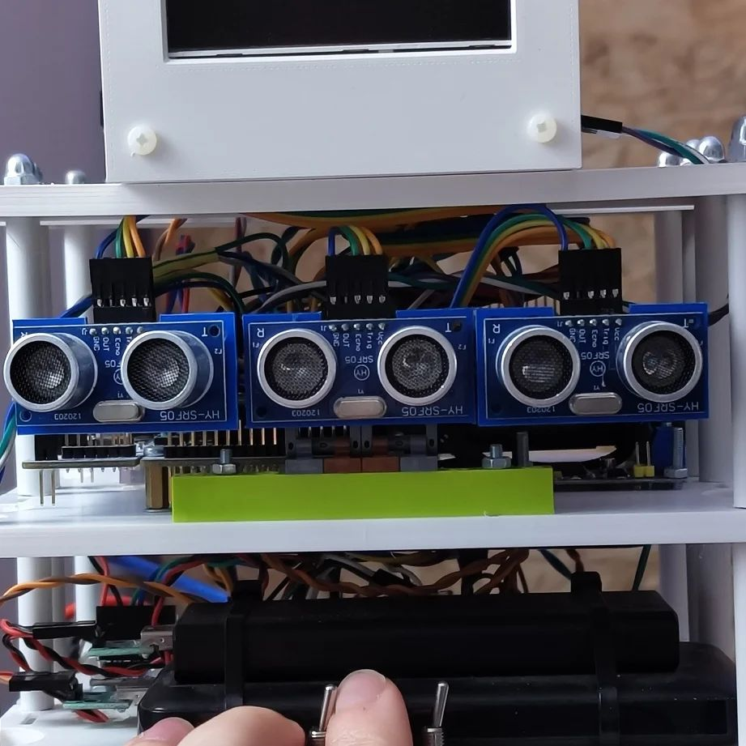

Updated code for the Sensor Unit with qCAN support is merged and documented!

- Source code: https://github.com/Zakhar-the-Robot/io_sensors
- Documentation: https://zakhar-the-robot.github.io/doc/docs/systems/io_sensors/

<!--more-->

