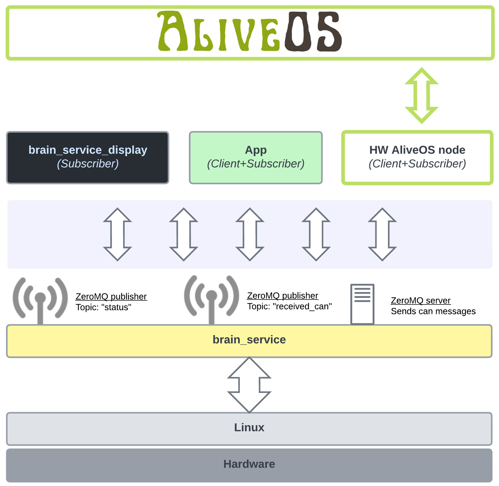

Before updating Alive OS to support [qCAN (my CANbus based protocol)](https://zakhar-the-robot.github.io/doc/docs/communication-protocols/canbus/) I have the last thing to do. To simplify my live in future I need a CAN publisher that can publish messages to many subscribers. My main subscribe of course is AliveOS but also to display information about connected devices I need a second subscriber - a service listening only qCAN Present messages.

To do it I will use a [ZeroMQ protocol](https://zeromq.org/) - an extremely supported and documented for many programming languages standard. I'm going to update my brain_service to support the protocol and it will be responsible for all interaction with Raspberry Pi.

<!--more-->

