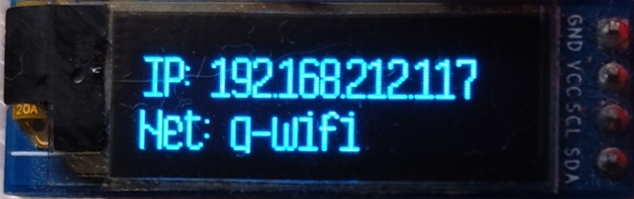
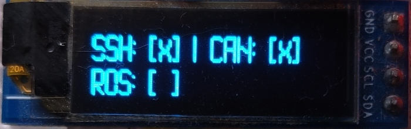
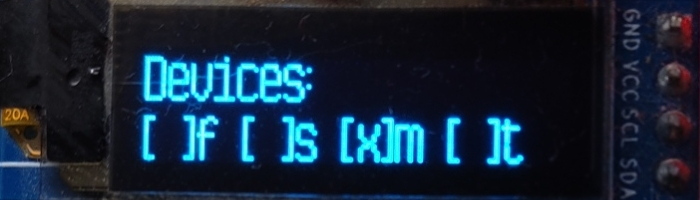
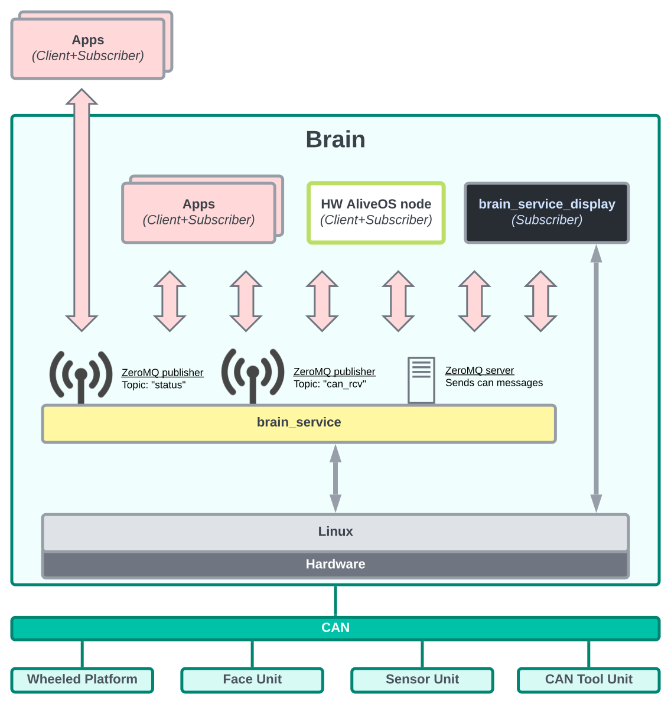

Yesterday I merged a big software update to the Zakhar's Raspberry Pi Unit - `brain_service`.

The update brings a service providing the robot's status (network, OS status) and access to the CAN bus for many simultaneously connected clients. Also, the service tracks the presence of other robot Units on the CAN bus.

<!--more-->

There is another service shipping with the same repository `brain_service_display`. This service connects to `brain_service` and shows some important information on a small OLED display:

- f - Face Unit
- S - Sensor Unit
- m - Wheeled moving platform ("Motors")
- t - Service Unit ("Tool")

The service structure is presented below:

The service publishes status information and incoming CAN messages to [ZeroMQ](https://zeromq.org/) subscribers. The service allows all TCP connections including connections from external machines. See [brain_pycore](https://github.com/Zakhar-the-Robot/brain_pycore) for compatible subscriber and client implementation classes.

Sources:

- https://github.com/Zakhar-the-Robot/brain_service
- https://github.com/Zakhar-the-Robot/brain_pycore
