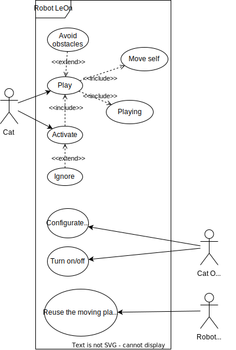

With this post, I start my new robotic project. This project will have several important features:

<!--more-->

- Architecture-oriented
    - Develop the right architecture using architectural best practices
- Result-oriented and minimalistic
    - Progress over perfection
- Integration-oriented.
    - Reusing existing libraries, projects, etc. Minimum development of individual pieces
- Reusable in my other projects
    - It should be done automatically with a good architecture. But I want to make several special decisions to make the project easy to transfer to my another robotic project

# What is the project about?

It is a cat companion. A simple robot that can move around, avoid big obstacles and move a stick for playing with a cat.

# What is the first step?

I’m starting with the architecture development. I will try to make the most abstract decisions first, leaving the implementation details to the very end. 

The first step is development of the use cases. Basically, there are 3 actors for this robot - a cat, a cat owner, and me, a robotic developer. As a developer, It is important for me to have a moving platform (legs, wheels, etc.) reusable by other projects, so it is also reflected in my use case diagram:

That is it for now. Next time we will probably define the system requirements based on each use case.
