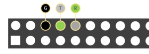

1. [Download](https://www.raspberrypi.org/downloads/raspbian/) and write Raspbian or something similar;
2. Add to config.txt on flash card:

```
# Enable UART
enable\uart=1
```
<!--more-->
3. Connect as on picture:


