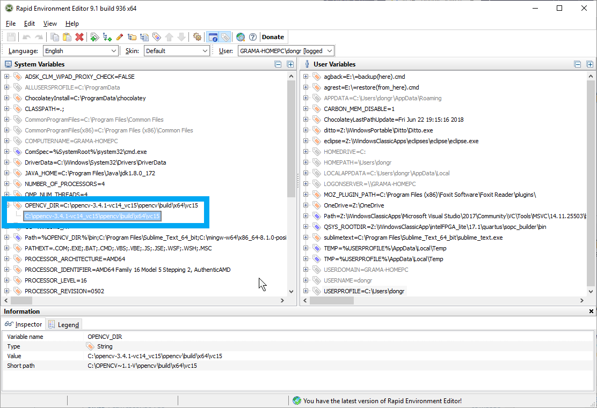
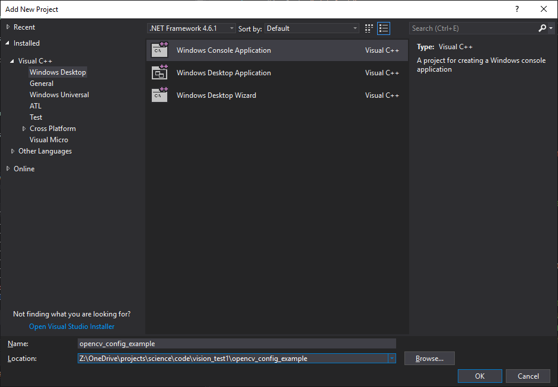
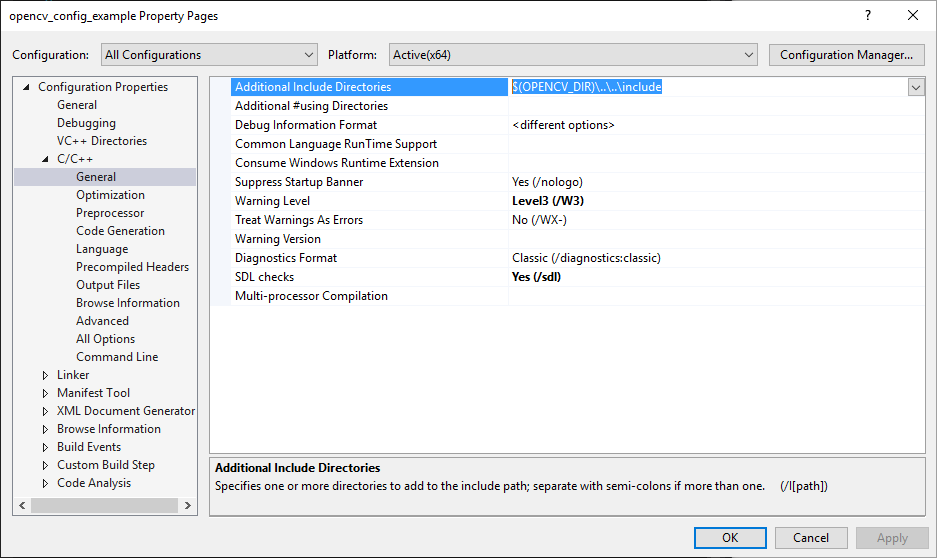
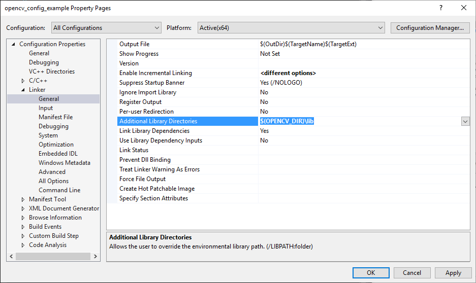
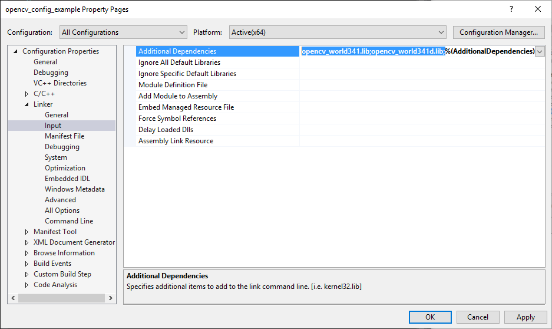
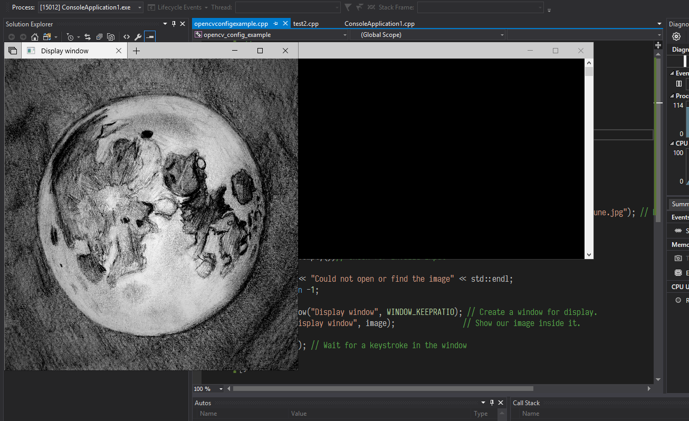

1\. Get software:

- [OpenCV](https://sourceforge.net/projects/opencvlibrary/files/opencv-win/) (for this article writing time 3.4.1 is the last version)
- [Visual Studio](https://visualstudio.microsoft.com/downloads/)

2\. Install Visual Studio; Unpack OpenCV somethere and [add enviromental variable](https://www.rapidee.com/en/about)

<!--more-->

`OPENCV\_DIR = C:\\opencv-3.4.1-vc14\_vc15\\opencv\\build\\x64\\vc15`



3\. Create Windows Console Application in Visual Studio



4\. Add OpenCV to a project property

- Add `$(OPENCV_DIR)\..\..\include` to C/C++ - General - Additional Include Directories



- Add `$(OPENCV_DIR)\lib`  to Linker - General - Additional Library Directories



- Add `opencv_world341.lib` and  `opencv_world341d.lib` to Linker - Input - Additional Dependencies



5\. Add code (add path to you image at 13-th line):

```cpp
#include "stdafx.h"

#include <opencv2/core.hpp>
#include <opencv2/imgcodecs.hpp>
#include <opencv2/highgui.hpp>
#include <iostream>

using namespace cv;
using namespace std;

int main(int argc, char\*\* argv)
{
    string imageName("Z:/OneDrive/projects/science/code/vision\_test1/vision\_test1/lune.jpg"); // by default
    if (argc > 1) // run with argument
        imageName = argv\[1\];
    Mat image = imread(imageName.c\_str(), IMREAD\_COLOR); // Read the file
    if (image.empty())// Check for invalid input
    {
        cout << "Could not open or find the image" << std::endl;
        return -1;
    }
    namedWindow("Display window", WINDOW\_KEEPRATIO); // Create a window for display.
    imshow("Display window", image); // Show our image inside it.

    waitKey(0); // Wait for a keystroke in the window
    return 0;
}
```

6\. Build and RUN!


