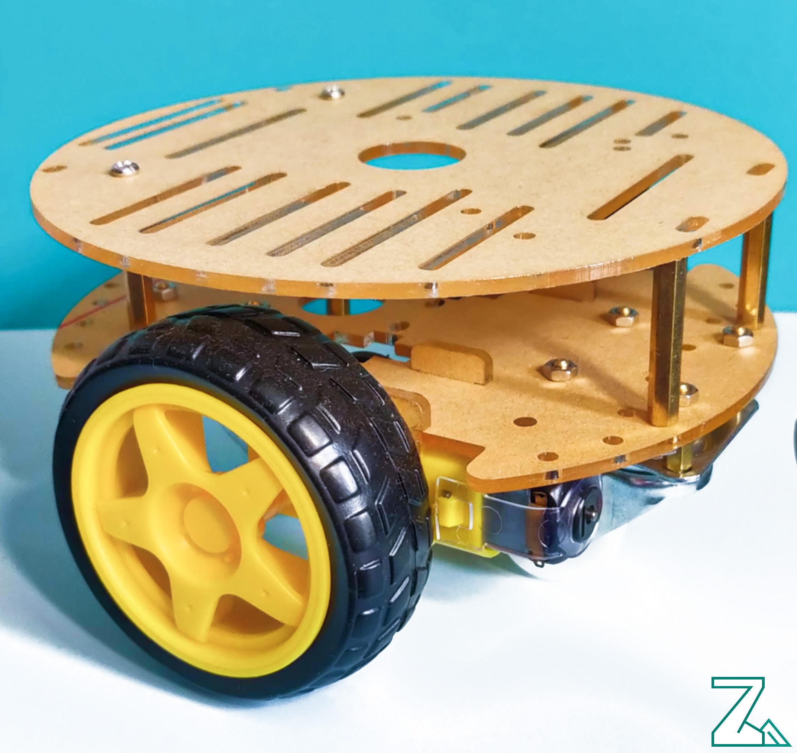
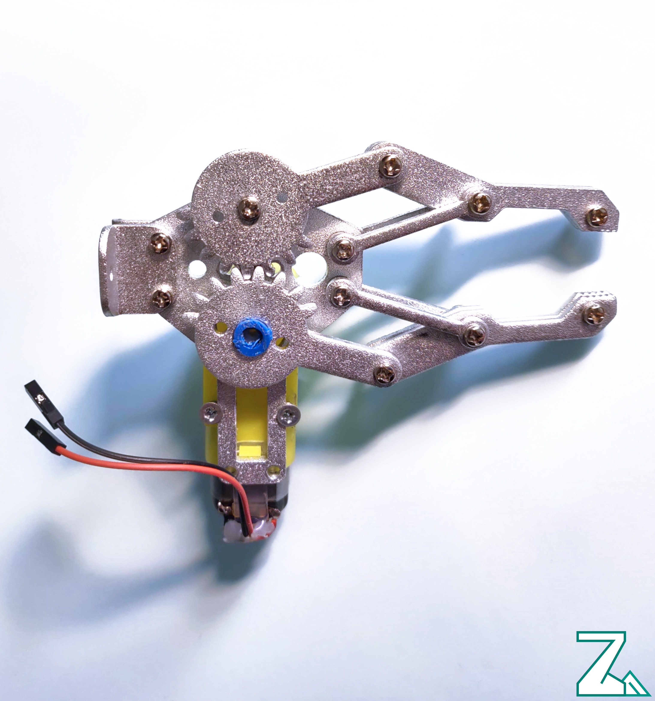
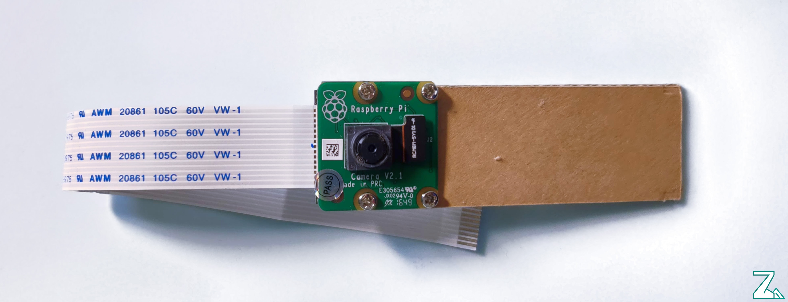
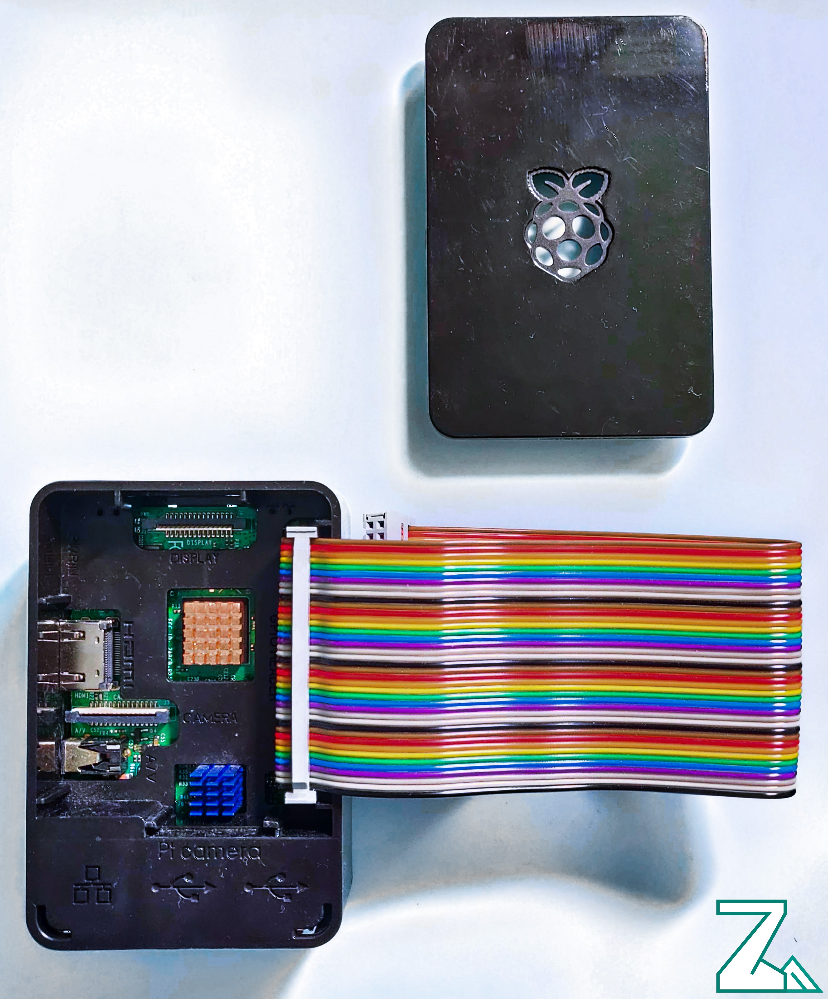

After a lot of experiments with Raspberry, ESP32, STM32 and Arduino boards I've decided what will be a spine of the [Zakhar](https://github.com/an-dr/zakhar) project. [ROS](https://www.ros.org/) seems the most interesting and extendible. Inside it, I could combine Python, C, C++ programs (hence, libraries ) working inside a Linux environment and communicate with any other platforms.

Say, I could build a system on a Raspberry, which will communicate with developer board like [ESP-WROVER-KIT](https://www.espressif.com/en/products/hardware/esp-wrover-kit/overview) working on FreeRTOS. Even more, I could use my desktop as a part of the system for High-level computing (say, for image recognition with OpenCV).

I have bought some hardware for the new version of Zakhar, called **Zakha\_ros:**<!--more-->

## The new hardware

**1\. Platform.** It is a simple platform which I used for my first experiments 3 years ago:

**2\. Manipulator.** It based on DC motor and an aluminum chassis. Nice to grab something.

**3\. Camera.** I've bought a standard Pi camera than mounted it onto a small cardboard panel

**4\. Raspberry Pi 3 B+.** With a nice black case.

 

## What's Next

Next, I'm planning to update a [Zakhar concept](https://agramakov.me/wiki/doku.php?id=zakhar:main) to follow ROS capabilities and using hardware. Stay tuned!
