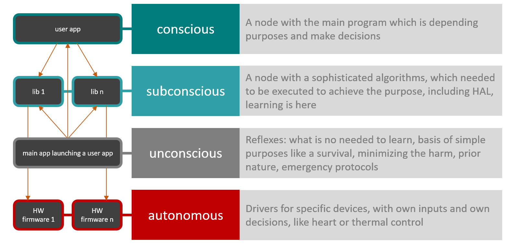

It is not a secret for anybody, what we are living in the era of consumption. We produce and consume food, medical preparations and of course, the flagship of the planet's economics - electronics. Modern electronics are becoming more and more sophisticated, hard to understand and we have to spend time to learn it. It so, because there is a huge gap between the level of development of technics (which the main face is electronics) and user interfaces. "User interfaces" it is a quite new term, and researches in that fields are conducted only in the last several decades. Previously we could talk about ergonomic, but the question of how to use a technical tool was not asked hard way as now. Let's take a look at the most technologically advanced and widespread instrument, we have today - a smartphone.<!--More--> Talking about people, using it in most of the context we have to split them into "users" and as-called "power users". The first category is the people, who are using only basic functions of the device. They can write a message, make a call, charge a device and take a photo. Commonly they are do not understand the behavior of the device, they do not know if the device could work under the water, at the cold temperatures, they are do not know how say, Android devices will cooperate with each other is touch it's backsides or how to transfer text from an iPhone to a MacBook. It is a really natural and normal situation, cause a man is a social creature - that is mean, the most important skills it has, how to cooperate with other people. Talking about interacting with others a middle man is a power user. That is so because of those points:

1. To understand others is the vital skill for any highly organized animals
2. To understand the self is the vital skill for any form of life
3. Thanks the similarity of any human, the first and the second quality is connected.

Because of these circumstances, we can understand each other, we can interact with each other productively, became a power user of each other. The more similarity between us and other animals, cause better cooperation. Look, how we interacting with dogs or cows, look at how we interact with jellyfish and bees. I claim, the more resembling in inner processes, especially that connected with the outer behavior tightly, the more effectiveness and simplicity we are getting during interacting. Talking about such artificial thing the technics are, we are not understanding how it works, we can not imagine how any our interact connected with the result which technics provide are - without preparations and learning of the subject. There is a lot of approaches on how to harmonize interfaces with our perception, but making systems complicated all the time requiring finding new approaches. At modern times we can talk to our smartphones, we can use unmanned transport, we are almost got robots as companions. But in many cases, without learning rules and conventions of that kind interacting of us with our technical tools is useless. I can see two main ways how to simplify interacting between users and a technics:

- Learn how to a technics works
- Learn a technics to work like other people

The first approach we are using all our modern lives, the second one became more important in the last years (Google Duplex is an ambassador of this approach). As I said we are standing on the start line of the mass robotics. But still and all the time when we are talking about it (are do that a lot!) we are considering, what the robots would be fundamentally different from life existing before. We are justifying this based on facts what electronics based on different principles than organics. And we are ready to create sophisticated robots with a straight fully logical program, which can not understand us and therefore could lead us to different problems including a total mankind extinction. We are trying to develop systems to control and to hold AI, we are afraid of the future so much what we can not see the most obvious thing. We already can control and understand each other perfectly. Evidence of this is our existing for thousands of years. I suppose, if we really want (directly or indirectly) to create a new form of life which could co-exist with us there is the one way - study yourself and make something based on that we are now is. In my robotics hobby, I’m trying to follow ideas which are at the basis of the human mind. And for it is a more interesting approach than just reproduce elements of Rumba in my robots. I was thinking a lot about how the human mind works. Fortunately almost all human culture, starting from literature ending the serials - is a clue to an understanding of this. I can tell at least 4 relatively solid and standalone parts of the human mind:

1. Conscious - the [locus of attention](https://cs.stanford.edu/people/eroberts/courses/soco/projects/2001-02/hci/locus.htm), watcher of the current process.
2. Subconscious - the part of the mind where the most sophisticated thing is doing. Subconscious is learning all the time, it collects and full the input data by meaning. All the time we learning any new move in dance or yoga, subconscious being under the conscious watch trying to figure out how to connect out desire with body’s capabilities.
3. Unconscious - represents our reflexes and instincts. When something goes out the control, the unconscious is turning off a conscious and use subconscious with all it’s skills to follow things to a more appropriate way, say to take away a hand out a fire. It is the source of the fight-or-flight response, reaction for the pain and so on.
4. Autonomous systems. Not all parts of our bodies could be following by direct orders of conscience or unconscious. The heart will works until you died, the hair will grow even further and we can not change it significantly by own.

At [my previous article](https://blog.agramakov.me/2019/05/05/zakhar-relaunch-zakha_ros/), I told my main robotics project - Zakhar the Robot is relaunched to get a new name, `Zakha_ros`. And following there is an idea of how it should work keeping in mind all the said previously:

In terms of the software, Unconscious seems like the kind of actual human operating system. It could start, pause or terminate the Conscious. It is a stable core which is changing rarely and being a standalone part of our minds.  Conscious - is the child process of Unconscious and the second user of the Subconscious. Talking about manned robots - it is an operator using human-computer interfaces. Talking about unmanned ones - who knows. Subconscious - is the most flexible part of the mind. This is it’s the main mass and instrument. For robots - the most logic and hardware abstraction layer concluded here. It is a rewritable program, which is updating all the time. But as a first approximation, we could consider it as a fixed one. Autonomy systems - the simplest part. It could be any device, controlled or not with other parts of a robot. But mandatory connected with the robot. Following these ideas and developing it’s the next step I’m planning to realize a moving system of `Zakha_ros`, so stay tuned!
