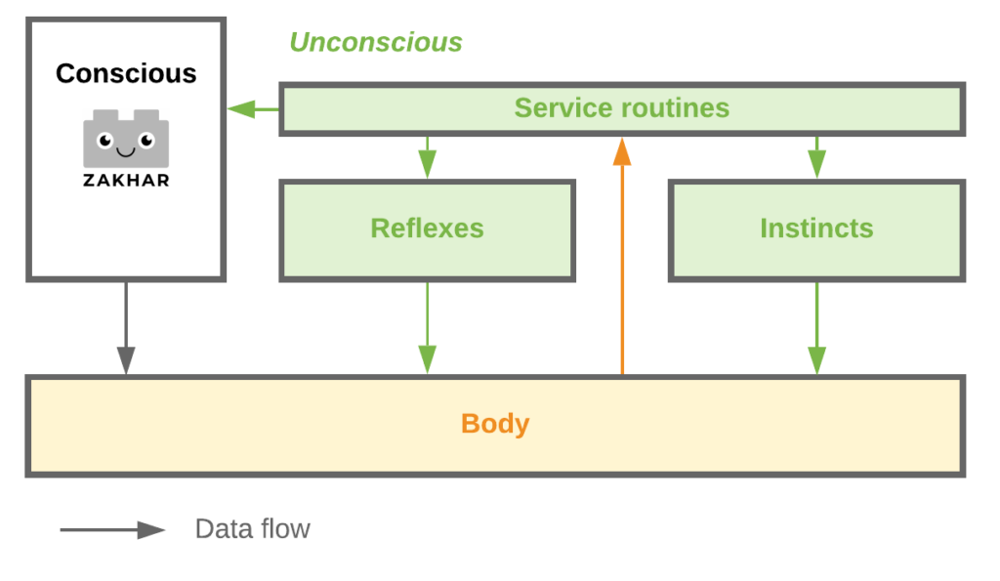
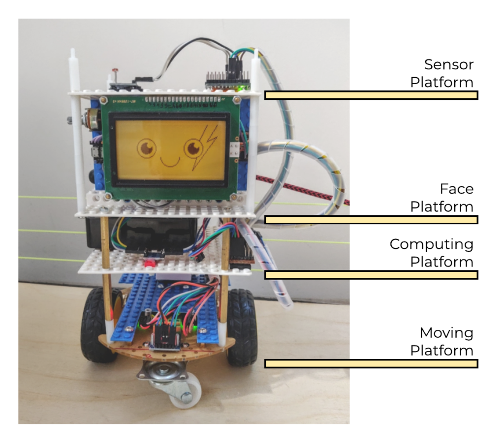
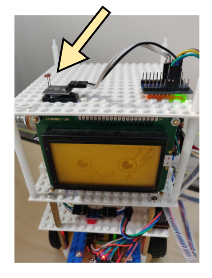
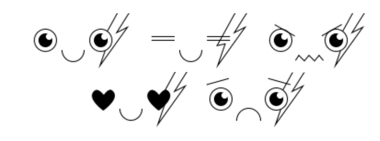
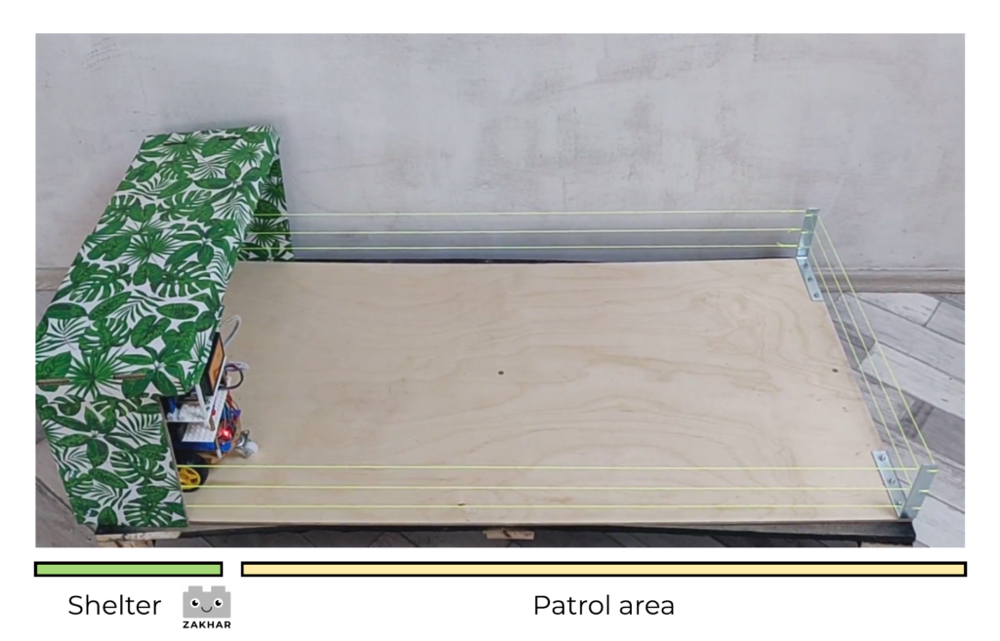

Author: [Andrei Gramakov](https://agramakov.me)

# 

## The Problem

Nowadays, an increasing number of people is facing technophobia, a fear of technology. There are many possible causes for this, such as the following:

<!--more-->

- Possibility of technical product damage, not understanding the correct treatment
- Lack of experience
- Fear of changes \[1\]
- Effect of uncanny valley \[2\]

All these causes are inherent to human mind, but possibly can be solved or bypassed.

## The Solution

The most comprehensive response to the problem, as it is seen by me, is to make a robot more resembling to those type of things with which we  interact all our lives: to other alive creatures, ourselves, and our pets. In other words, I want to naturalize the robot behavior. How would it solve the problem?

- As the main purpose of any living creature is to keep itself alive, most of the developed animals have a system of signals, telling other individuals what kind of interaction is acceptable is and what kind is not. These signals are basically emotions and reflexes. And this way I suggest telling user to handle the robot properly.
- These hints should fill the gaps in the user’s experience, in the most natural way.
- Also, fear of changes should be reduced, because with this approach we are creating just another type of animals, but not a cold rational machine without emotions and mercy. We are not teaching people how the robots works, but familiarity of the behavior should tell to the user’s unconscious part of the mind, that “if something looks like a duck and behave like a duck, then it is a duck”.
- At the same time, I want to restrict myself only by some degree of humaneness. Robots should be either indistinguishable of people or clearly distinguishable, to avoid of the famous effect called “uncanny valley” where the robots are absolutely disgusting and terrifying.

As the core of our brain is a so-called reptile brain, I want to start from reproducing the reptile behavior. I will return to this in several pages.

## Basic concept

### Program structure

Trying to repeat animal’s behavior, I want to introduce such kind of robot’s program that follows the structure of human’s mind. I am not a specialist in psychiatry, so after amateur reading of C. Jung, D. Hume, E. Fromm, S. Freud, S. Harris and a lot of other great scientists who investigated the human mind, I’ve decided that Jung worked with the most applicable for my purpose entities.

I am aware that science had moved much further from his time. For me, an electrical engineer, it is difficult to set apart good and reasonable modern ideas at the field of psychiatry of the bad ones. Therefore, I am relying on works of C. G. Jung as it has passed the test of time.

So, let us divide the program into parts using psychiatric concepts. Firstly, let us divide the program into two parts, the Conscious and the Unconscious. It should be more or less simple to specify what should do a Conscious is basically our Ego and will.

Next, we will use a simple idea by C. G. Jung: “the unconscious aggregates all psychic phenomena that do not possess quality of consciousness”.\[3\]

Also, Jung writes at Conscious, Unconscious, and Individuation \[4\] that Conscious has the only center – Ego, while Unconscious, it seems, has no center, and represents a lot of simultaneous psychical processes. So, we will use only one dedicated thread for the Conscious and all other processes of robot’s program will be placed into multiple threads of the Unconscious.

At the same article it is claimed: “it frequently happens that unconscious motives overrule our conscious decisions, especially in matters of vital importance”  so we will implement it too, i.e. the main program representing by Conscious will be disconnectable of robot’s control in some specific cases. We will define these cases later.

Now let us define what will be defined at the Unconscious part of the robot’s mind. Obviously, it should be all processes collecting and handling information from sensors. As we never think how to match information from our two eyes, robot should not interpret information from his photosensors at the main program.

Also, Unconscious should contain all the vital parts supporting the program structure we are discussing here. So, Unconscious should have mechanisms to take control over the things in possession of Conscious and return them back. While it has the control, Unconscious should have the set of alternative programs using the same resources that the Conscious used to.

We will implement sophisticated complex behavior patterns – instincts, as well as simple responses to external (and maybe internal) impacts – reflexes. That is it for now. So, our program should look like:

- Conscious
- Unconscious
  - Reflexes
  - Instincts
  - Service routines

Let us determine these parts more concrete.

**Conscious** represents simple intentions: move forward, sleep, run away, search something, etc. That part should be lightweight in terms of used resources, should consequently form simple tasks for the **Unconscious.**

**Unconscious** is responsible to solve how to realize those intentions: what to do for moving, how to behave in the searching process etc. Also, that part is doing all service and handling works, like pattern recognition, implement all the internal program interaction between program’s threads.

**Reflexes** are small algorithms that can monopolize Conscious resources in some very explicit situations, e.g. emotional reactions to fear, anger, and pleasure, blinking and other automatic reaction that does not involve a lot of data handling.

**Instincts** are also algorithms that can monopolize Conscious resources. They act a bit differently and should implements sophisticated behavior like how to behave if you are afraid, how to behave if robot is stuck somewhere (convulsions, or something), fight-or-flight response, etc.

**Service** routines should handle information from sensors (image and sound recognition), provide the result to the **Conscious, Instincts** and **Reflexes** programs**.** Also, this part should have control over queue of the execution i.e. it should do whatever other parts are not doing.

Possible data exchange scheme is shown on Figure 1.

****

**Figure 1 – Program diagram and data flows**

Now I will talk about reflexes.

### Reflexes

**A reflex**, or reflex action, is an involuntary and nearly instantaneous movement in response to a stimulus. A reflex is made possible by neural pathways called reflex arcs, which can act on an impulse before that impulse reaches the brain. The reflex is then an automatic response to a stimulus that does not receive or need conscious thought. \[5\]

Those responses were investigated by a Russian physiologist Ivan Pavlov. And can exists in two hypostases:

- unconditioned response
- conditioned response

The last one is connected to so called Classical conditioning.

**Classical conditioning** occurs when a conditioned stimulus (CS) is paired with an unconditioned stimulus (US). Usually, the conditioned stimulus is a neutral stimulus (e.g., the sound of a tuning fork), the unconditioned stimulus is biologically potent (e.g., the taste of food) and the unconditioned response (UR) to the unconditioned stimulus is an unlearned reflex response (e.g., salivation). After pairing is repeated the organism exhibits a conditioned response (CR) to the conditioned stimulus when the conditioned stimulus is presented alone. (A conditioned response may occur after only one pairing.) Thus, unlike the UR, the CR is acquired through experience, and it is also less permanent than the UR. [\[6\]](https://en.wikipedia.org/wiki/Classical_conditioning)

For us it is interesting because these concepts are very convenient for describing building parts of robot’s **Unconscious** part and also get us a hint how to implement a simple learning process without implementing neural algorithms (which are resource-intensive and non-reliable without a proper teaching process). For that problem of the simple learning I have created a separated project called **r\_giskard** (named after the robot from Isaak Asimov’s books), but for now it is in an early state.

Now let us talk about probably one of the most important for the project part – about emotions.

### Emotions

One of the instruments that the project is using on the way to make robots more comfortable to interact with is emotions. It is unclear if the emotions are the same as reflexes [\[7\]](https://www.iep.utm.edu/emotion/), but it seems that emotions at least are reflexes-like. So, at this work we can handle them the same way at least at the first estimation.

While there is not one single definition of emotions, emotions have an **expression** component that we will use. This component can be used to expose an internal state of the robot. One of the most familiar expressions for primates are facial expressions. Facial expressions tell others what the individual tends to do in a given situation.

## Proof of Concept

### Main Idea

As a first proof of the concept I’ve build a robot named Zakhar (and its project is called in turn The Zakhar Project) and have prepared it for the first demo. The demonstration should expose cooperation between Conscious and Unconscious. The Conscious part of the program will execute some simple program - an infinite pattern of movement: move forward, stop, turn right, stop again move forward etc.

Then I simulate a fright. Fright program represents instinctive behavior and should make the robot express fear and make him flee until he achieves a safe place. Then at the safe place, robot is switching back to the Conscious program. Safe place is a place with much darker environment than was at the moment of the fright.

As a trigger I am using a simple change of light environment that resembles a shadow of a flying bird, e.g. flashing shadow. Because all the behavior reminds me a behavior of a small lizard (and is it the first step in my robot’s mind), I called the demonstration The Reptile Demo.

### Criteria of the Success

As we are talking about feelings which the robot should evoke, probably we should find the hint if the concept is successful in emotional responses to the robot. Zakhar should evoke a positive or negative emotion respectfully to the situation. His actions should be clear to the observer and the observer should correctly read the context of the situation (e.g. if the robot tries to avoid something or something is attracting it). Probably it will be more obvious later, after collecting and analyzing reactions to this article and a Zakhar’s social page [\[8\]](https://www.instagram.com/zakhar_the_robot/).

### The Robot’s hardware

The Robot Zakhar (further, just Zakhar) consists of 4 platforms (Figure 2) connected through I2C interface:

- Sensor Platform
- Face Platform
- Computing Platform
- Moving Platform

**Figure 2 – Zakhar the robot**

Moving platform represents two DC motors with rotating encoders, connected to a control board, which are in turn connected to Arduino Nano. Computing platform contains a one-board computer Raspberry Pi 3B+.

For this particular demonstration, the Sensor Platform has only one sensor – photoresistor, which can register changes of light environment (Figure 3).

**Figure 3 – Light sensor**

## Facial Expressions

Right now, the project has 5 facial expressions (Figure 4). I have asked a designer [\[9\]](https://www.instagram.com/sveta._shadow/) to draw them in a way to make expressions simple, easy to read and distinguishable.

**Figure 4 - Faces used by the Zakhar project. Copyright (c) 2020, Svetlana Iakurnova**

While emotions are not implemented as separated reflexes yet, the robot’s program uses those expressions at relevant situation as part of other reflexes and instincts. These expressions are drawn onto LCD display (Figure 5)

**Figure 5 – Basic (calm) expression on the LCD with resolution of 128x64 pixels**

## In Action

The demo consists of two parts:

- Patrolling
- Reaction

The platform for this demonstration consists of two areas (Figure 6): the shelter and the patrol area.

**Figure 6 – Demo scene**

The starting point is the shelter. Zakhar rides out of the Shelter and starts to patrol (Figure 7).

While patrolling the layout of bird is passing above the robot. It is a trigger to turn off the Conscious and start to execute the Panic instinct. The Panic instinct is following:

- Stop doing anything
- Express sadness
- Trembling
- Moving forward until the light environment falls to 0.8 of the initial light
- Express calm
- Trembling
- Return control to the Conscious program

**Figure 7 – reaction to the fright**

At each part of the demonstration, Zakhar expresses a different emotion. Changing of the expressions with the same program is shown on Figure 8.

**Figure 8 - Expressions**

Videos of this demonstration are available on YouTube [\[10\]](https://www.youtube.com/watch?v=xyb9NgWsHNY)[\[11\]](https://www.youtube.com/watch?v=Wdd7dPXa3mQ)

## Conclusion and Further plans

At the demonstration you can see the behavior that roughly resembles the behavior of animals. Also looking at the behavior, you can easily see and understand what the robot is trying to avoid. Instead of fear of birds, robot can possess other different phobias, like hydrophobia (for non-water-resistant robots), agoraphobia – for robots designed to work on a small territory (like robot vacuum cleaner) and other.

On the other hand, robots can hit to use them with different kinds of philias and addictions, like addiction to charging and philias tuned to the best functional temperature, for example to keep chemical batteries longer (as you know,  capacities of a li-ion cell are reduced at low temperatures).

Also, I hope to make a better user experience then offered by silent and devoid of any emotion robots like Dog by Boston Dynamics and to not create terrifying uncanny robots.

At the next two iterations I am going to implement claustrophobia to keep a robot on the open spaces and mechanism of “heat of passion” to signalize the user when his treatment of the robot is unacceptable. At the same time, I want to work on design and to develop system of measurement of user’s understanding of the robot’s behavior. The current plans and status of this experiment can be tracked on the website of the project:  [https://zakhar.agramakov.me](https://zakhar.agramakov.me).

Thanks for the attention!

_Correction: [Galina Deeva](https://www.kuleuven.be/wieiswie/en/person/00112699), KU Leuven_

## References

1. A Study on Technophobia and Mobile Device Design, Joong Gyu Ha, 2011
2. Anthropomorphism and the social robot, Brian R. Duffy, 2003
3. Instinct and The Unconscious, C. G. Jung, 1919
4. The Collected Works of C.G. Jung: Volume 9i: The Archetypes of the Collective Unconscious, 2014
5. Wikipedia: [https://en.wikipedia.org/wiki/Reflex](https://en.wikipedia.org/wiki/Reflex)
6. Wikipedia: [https://en.wikipedia.org/wiki/Classical\_conditioning](https://en.wikipedia.org/wiki/Classical_conditioning)
7. The Internet Encyclopedia of Philosophy: [https://www.iep.utm.edu/emotion/](https://www.iep.utm.edu/emotion/)
8. Instagram: [https://www.instagram.com/zakhar\_the\_robot/](https://www.instagram.com/zakhar_the_robot/)
9. Svetlana Iakurnova: [Behance.net/svetlanayakurnova;](https://www.behance.net/svetlanayakurnova) [Instagram.com/sveta.\_shadow/](https://www.instagram.com/sveta._shadow/)
10. YouTube: [https://www.youtube.com/watch?v=xyb9NgWsHNY](https://www.youtube.com/watch?v=xyb9NgWsHNY)
11. YouTube: [https://www.youtube.com/watch?v=Wdd7dPXa3mQ](https://www.youtube.com/watch?v=Wdd7dPXa3mQ)

## Links

- **[Project's site](https://zakhar.agramakov.me/)**
- **[Project news on hackaday.io](https://hackaday.io/project/171888-zakhar-the-robot)** and **[blog on the dev's site](https://blog.agramakov.me/category/zakhar/)**
- **[Instagram](https://www.instagram.com/zakhar_the_robot/)**
- **[Sources on GitHub](https://github.com/an-dr/zakhar)**
- **[Build instruction on hackster.io](https://www.hackster.io/an-dr/zakhar-the-robot-0d8744)**

Developer: Andrei Gramakov - **[agramakov.me](https://agramakov.me/)**
